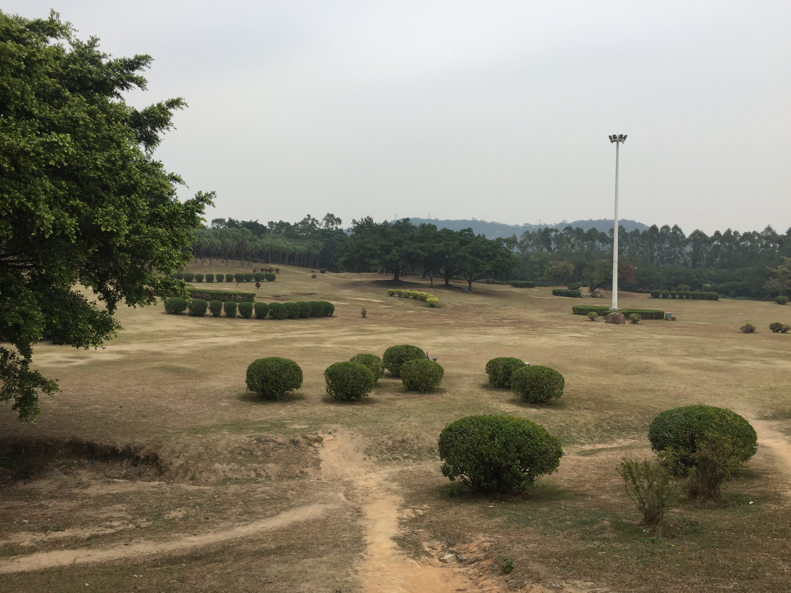
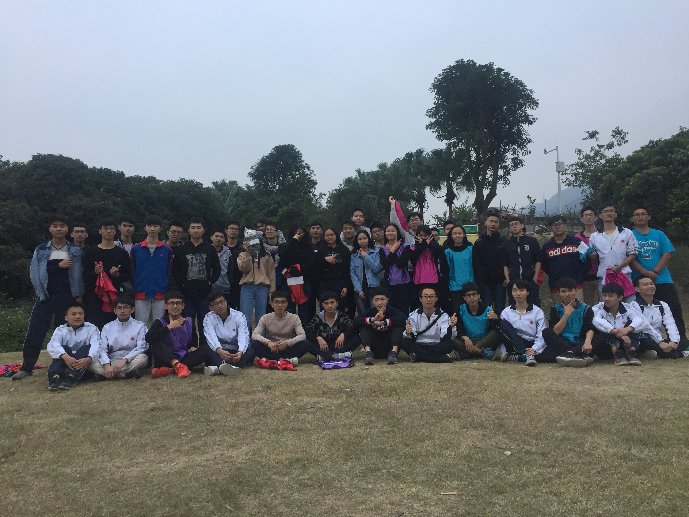
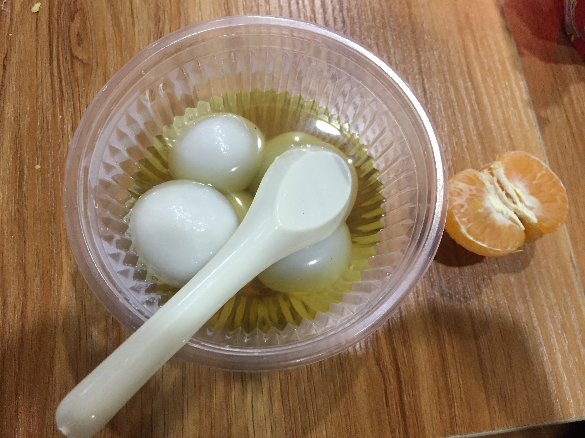

My Daily
-------- 
> 圭峰山烧烤 2017-12-16

#### 活动初始

在昨天，新生班举办了烧烤和撕名牌活动，活动一开始策划时，班委们在群上讨论不出结果，有些又不说话，只是围观，那时我有点发火，索性安排到食堂面对面进行讨论，简单讲了大概组织什么活动。本以为可以放心交给班委们，但后面活动的组织有点混乱，由于班委之间没有好好沟通，出现了很多问题。原本计划是下午来刷四级真题的，实在放心不下，按照以前我会思考很多东西，这次吃完饭就到南门搭乘公交，和十多个同学一起过去，直接行动派更重要。

#### 久违圭峰

圭峰山只来过三次，一次是大一时学长带领过去爬山，两次是同乡会烧烤，距离上次大概有一年多没来了。环境没有什么变化，旁边还是那个滑草场，一切都是那么熟悉，不过有点物是人非的感觉。虽然活动中间有很多问题，活动举办还算顺利。大家玩得很hi，在这点上我觉得还是很欣慰的。烧烤还是能够带动大家的，这是个大家都乐意参与的，没人能拒绝美食的诱惑：）。烧烤的主角是新生们，每个灶都有不同的味道，哪里烤好就去哪里打游击，能混到好多吃的感觉贼爽。烤了好久好久，基本把东西烤完了，之前同乡会都会剩下很多的，有点意外。烤完转移阵地到大草坪撕名牌，看到新生撕得很厉害，有点庆幸自己没加进去，不然可能被围着撕1_1。最后留下久违的大合照，真的希望带的这个班能顺顺利利，平平安安过完四年，一起毕业。话说我以前烧烤完都是直接回去了，现在想想有点后悔，都没去探究，没想到后面有很多东西，别有洞天，包括这个大草坪。好久好久没放过风筝了，希望以后能有机会，来这边来放放风筝吧。

#### 教训
- 有重要事情在群上很难讨论出结果，能出来讨论尽量出来讨论，这样没方法逃避，也不会有人围观。
- 沟通真的很重要，计划表，分工也很重要。
- 集体活动尽量举办集体大家能参与进来的。
- 做事要果断，雷厉风行有时也不失为是好的做法。
- 有时不要想太多，按自己觉得正确的做法直接行动吧。
- .......

#### 四级
其实就算不去参加烧烤，去复习，临时抱佛脚也不会有太大的进步的，英语不是靠突击就可以搞定的，而是靠日积月累的。相比于这个，如果我不去参加那个活动，我会很后悔的。说下考四级的感受，题目难度不是很难，但是词汇量和应试技巧会显得特别重要。我已经尽力，不管最后结果如何，我都会去接受，跌倒并不可怕，可怕的是不敢爬起来，总结教训，再次挑战。

#### 潮汕同乡会冬至晚会
今晚有冬至晚会，这是第三次参加了，还是跟以前没啥区别，花生，碳酸饮料，橘子，香菇肥牛，桌上摆放的还是这些，节目还是那种节目，没有一丝丝惊喜，和Ivan一起过去，但是他不太喜欢这种氛围，中途就走了。往年都没怎么吃到汤圆，今年有学弟们，终于轻松吃到了，还是挺开心的:)。
