My Daily
-------- 
> 我的大一总结

#### 我的大学前

在高三的时候，会有很多已经毕业的师兄师姐回到学校宣传自己的大学，其中不乏华农，广工这些一本学校，当然也有五邑大学的宣传会，五邑大学在来宣讲的学校里排名是非常靠后的。我有去参加了几个宣讲会，了解一些学校，一本的宣讲会生动有趣，座位爆满。五邑大学的宣讲会没多少人参加，寥寥无几，后来实在是觉得讲得太无聊就溜走了。那时就感觉五邑大学的学生跟那些一本重本的学生比起来水平差很多，无论是PPT视频的准备，还是演讲的能力，都不是在同一个档次上的。但是我记住了五邑大学，当时就把五邑大学当成未来填志愿保底的学校。

在以往下晚自习宿舍断电后我都会和朋友去楼梯旁边学习，平时习惯了，高考前一晚我没有去这样做，而是很早就躺在床上，结果失眠了，过了12点后全宿舍就我还清醒，整个宿舍充斥着呼噜声，我尝试数羊或者上网查等各种让自己放松的办法，但是还是很精神，最后演变成了内心极度恐惧慌张，思考各种糟糕的结果，突然对高考有点绝望。拖到5点多我累倒了睡了过去，睡了不到2个小时就起床复习了，那时回想起物理老师说过的话，人连续三天不睡觉都能保持精神上的清醒，我安慰了自己，没时间紧张就上考场了，第一天的发挥不是很好，早上的语文作文都不知道自己在写什么，数学是平时的套路，但是到后面就不会了。考试结束后和朋友去食堂吃饭，没有胃口，只是喝了点粥和吃了一个手抓饼，和朋友也没有像以往的考试一样讨论试题，而是聊其他东西，接着去超市，买了牛奶睡前促进睡眠，不知道是牛奶的作用还是太累，我晚修回宿舍没等到熄灯倒头就睡了，醒来以后整个人都很有精神，理综和英语完成得还算顺利吧。高考结束整个人都放松了，回到宿舍只听到整栋楼都在吼，忘记有没有丢书了，收拾东西准备离开呆了三年的高中，有点感慨，当时东西很多，我高中三年的书，试卷，总共有几箱，带回去很麻烦，我有点冲动，除了带几本有纪念的书回去，其他都留在了宿舍，不要了，想着就算考得不好我也不要复读，不想再经历那种痛苦。之后就是告别高三一起奋斗的舍友和朋友，坦坦荡荡走出校门，是的，我高中毕业了。

高考放榜的那一天，录取分出来时我缓了一口气，553分这个成绩不算太差，但是距离一本线却还很远。所以只能在二本里面挑选，但是是加入各种群，各种百度搜索，看贴吧，各种咨询，可能是之前的宣讲会的原因，让我对五邑大学有印象，当时是在五邑大学和惠州学院之间挑选，最后选择了五邑大学，也查过各种专业，看分数阶段，决定了网络工程专业，也填了允许调剂。剩下的就是漫长的等待了，接着是估算五邑大学的投档线，当时有预计的投档线高于我的成绩，或者和我的成绩相近的，有点慌，会不会被调剂之类的。直到查到录取信息才心安，我只比市外投档线高出4分，所幸没有被调剂。后面就是联系同乡会，在侨中高中见同乡会师兄师姐，加入班群，日常水群，收拾行李，高中同学聚会等等，这些都发生在那个长长的暑假。

#### 大学伊始
大学早早加入同乡会，联系好包车，就过来了，一开始过来不太习惯，对这边的饮食，这边的环境，都很不适应。来的当天很忙很忙，晚上就开了班会，见到了班级同学和学长们。

来到学校的第二天就开始军训，每天是军训服和校服轮流换，没有像初中和高中一样去基地军训，而是重复着踢正步和唱歌，一点都不好玩，教官人比较好，也懂得如何训练，和我们年纪差不多大，互相之间聊得来，那时是4个班一个教官，大家氛围相当好，军训结束后有很多人去送教官离开。

#### 树立进取之心
军训结束以后就是新生指导周，有各种讲座，但是有很多优秀的师兄师姐来宣讲，能学到很多有用的东西，至今还有印象的是我的学长李志勇和雄哥的宣讲，看了志勇的大学经历，他的大学生活好丰富，让我很羡慕，雄哥的演讲则很有趣，不是像别人一样鸡汤式的，而是实打实那种，给予了我很大的震撼。那时就给自己定下了很多的目标，希望沿着他们的道路，自己在大学也能取得一番成就。

#### 初败
军训和指导周期间我去参加了很多部门的面试，有学生会、律委、团总支等等，但是我面试表现得不好，不自信，有时说话结结巴巴，或者他们抛了个问题让我想，我思考不出来。一次一次的面试失败并没有让我气馁，我不断总结经验，刷知乎学习技巧。托此我有些过了一轮面试，最后一轮，一般都会是团队合作，组队策划一个方案，上台去讲，当时比较腼腆，我没有选择去讲，而是选择了协助类角色，比如策划之类的，结果我在最后一轮就被淘汰了。我没能进入部门。因为部门需要的是活泼主动的人，而不是内向不自信的人，当时的我有太多的不足，时至今日，我还是有点没加入部门的遗憾。

接着是班委的竞选，我竞选了心理委员，我是真的一心想为班级做些事情，但是落选了，这事给了我很大的打击。后面我参加了很多同乡会的活动和学长班级组织的各种活动来忘却失败的痛苦，那段日子过得是真的开心，但渐渐的，我发现这些活动一直都是在吃喝玩，我结识到的人有点像是在混日子，没有目标，每天就是把时间投入到各种娱乐上，我觉得再这样下去距离自己原来的目标只会越来越远,我内心开始焦虑。

#### 焦虑
计院的创客空间大概是临近国庆时就开始了招新，我舍友由于有点计算机基础，在正式招新前就被内推进了游戏组，班里也有几个人通过后面的面试成功进入，那时我连笔记本电脑都还没买，所以不敢去面试，准备是下学期再去面试创客空间。到后面看着班里的人经常敲代码，我的内心越来越慌，自己跟别人比差太多了。于是去问了学长一些方向等等的问题。

> 2015-10-12 </br>
学长，我高考前没想过高考会选计算机的，看到咱班里那些进了创客，我不知道他们是否真有方向，至少我目前不知道往那个方向，因为我真的是个计算机小白，虽然才大一，但看到那么多拼命的，敲代码上机什么的，我内心也会有些焦虑，我不知道我现在该做什么，学长你清楚自己的路怎么走，请给我些建议。

学长给我的建议就是慢慢找方向，慢慢摸索，现在是大一，不用着急。但是我内心还是很慌，可能是高中养成的习惯，就是竞争，总是把自己去跟别人比较，害怕自己落后。学长只是叫我继续学课内，叫我多看书，参加活动，但不具体，我不知道接下去要怎么行动，于是仍照常过，还是没有什么改变。


#### 我的组织
没能加入部门和当上班干让我有点失望，舍友也是和我一样遭遇。我不知道未来要怎么走，学长给我的建议对我没有太大的帮助。那时极度渴望有一个组织去容纳我。时间到了社团招新的日子，我得知社团人员有两种，一种是委员，即社团自己组织的部门人员，一种是会员，只要交钱就能加入。当时对什么都很好奇，交钱成为了跆拳道社和棋协、动漫社的会员。后面又鼓起勇气，去面试了招宣拓展协会网络开发小组和动漫社的组织部，舍友也有去面试动漫社的宣绘部。招拓面试我时有7,8个人穿正装面试我，当时很害怕，现在看来是真的有点傻，最后面试失败，原因应该是我说要下学期再买笔记本电脑，但是加入那个小组需要用到笔记本。在面试动漫社时则没有什么压力，经过前面几次的面试锻炼，我有了很大的进步，回答也还不错。社团的面试只有一轮，很快就收到信息，我在10月16号晚上收到了信息，我通过了面试，成为了动漫社组织部的一员。舍友也通过了面试。收到信息的时候我是无比开心的，我有了一个自己的部门，有一个能让自己去为之努力奋斗的地方，我充满着期待。

#### 辩论赛
大一的时候很喜欢参加活动，舍友们那时候也很活跃，舍友3人拉上其他几个女生报名参加了辩论赛，总共打了3场，我参加了后两场的一辩，因为各种原因，我们没有打赢过，但是我们真的很努力，我们看了很多辩论的视频和技巧，也很认真进行讨论配合，一辩稿我查了很多资料，反反复复修改了很多次，最后一场是和自己班的另外一支队打，最后输了，当时心情有点差，努力了这么久换回这种结果，不过我很服气，他们确实比我们好太多。当然他们最后拿了院级第一，打败了其他学院的队伍，参加的人里最后有4个人加入了辩论队,这是后话。这段经历也成为了我美好的回忆。
> 以前写的一辩稿 2015-11-07<br/>
谢谢主席，尊敬的评委，亲爱的同学们，大家好，今天的辩题我方的观点是朋友圈应该屏蔽老师，所谓朋友圈，是指腾讯微信上的一个社交功能，它能调节个人的心理状态，摆脱个人独处时的孤独感，逃避日常生活中的烦恼，是寻求心理压抑的释放渠道，成为了很多人记录日常生活，发牢骚的好去处。老师是我们学生时代的引路人，对我们未来有着深远影响，当我们通过微信加了老师，能够互相联系，增进关系，但是，我们可以私聊，不必开放朋友圈，屏蔽二字是保持距离的意思，是为了不与老师产生误会，互相尊重，给彼此一个私密空间。所以我们应该屏蔽老师。我方主要有以下三点理由阐述：一：在朋友圈中，如果没有屏蔽掉老师，那我们的每一言都得三思，不敢发出自己真实的声音，因为不恰当的言论可能给老师留下坏印象，甚至给自己带来麻烦。比如在不久前，人大历史系教授孙家洲发布公开信，断绝与新招进的2015级硕士生郝相赫师生关系，理由是郝在朋友圈对北大教授阎步克及人大教授韩树峰“无端嘲讽”，违背“师生之交首重道义”的原则。不管嘲讽对不对，朋友圈作为一个独立空间，发布着自己对现实的吐槽，当老师关注朋友圈时，可能使我们变得小心翼翼，生怕被老师讨厌，而发布老师喜欢的消息，使得发朋友圈变成了一种对老师的迎合，那朋友圈就失去原有的功能，再也不是我们发牢骚，记录日常生活的好去处了，那么朋友圈就失去了它的意义，而且可能在好友看来你是在装逼，反而把你屏蔽，得不偿失，所以我们应该屏蔽老师。二：朋友圈作为一个虚拟的社交平台，发布的多是生活的琐碎，而我们与老师毕竟是两代人，生活作风和习惯都不同，老师关注学生是出于关心，但这种关心有时对我们来说是压力，老师会在意我们的成长，把我们限定在条条框框里，这无疑是枷锁，而朋友圈使得这层枷锁变得无处不在，据数据显示，大部分的学生都会选择屏蔽老师，因为在老师长期的压制性的关注下，只会产生逆反心理。一旦我们发布有关早恋或是其它发泄内心的消息时，就会遭到老师的质问，毕竟我们与老师的思维模式是不同的，代沟无法消除，我们的独立之思想，自由之精神也在萌芽中被扼杀。所以屏蔽老师是为了保持一下距离，这对老师是一种尊重，对自己更是一种保护，亡羊补牢，为时未亡，在场的各位如果还没屏蔽的话赶紧屏蔽吧！三：朋友圈是发布私人消息的空间，如果我们的一言一行都暴露在老师的注视下，将使得我们不敢发真实的东西，造成了表面上的和谐，但会加深和老师的代沟，人与人的距离似乎缩近了，实则拉开了，何况我们每个人有着只能与同学朋友分享的秘密，而对老师不能说的悄悄话。老师也并不只能通过朋友圈了解我们，我们可以借助微信一对一或打电话甚至见面与老师谈心，让老师了解自己，而不是让老师闯入自己的私人空间，随着我们成长，隐私也越来越大，希望有属于自己的独立空间，一个可以任自己吐槽的朋友圈。老师看着我们成长，我方认为成熟的标志是有自己的隐私空间，屏蔽掉老师，相信这也是老师能够理解和希望的。综上所述，我方深信，朋友圈应该屏蔽老师。

<div style="clear:both;"></div>
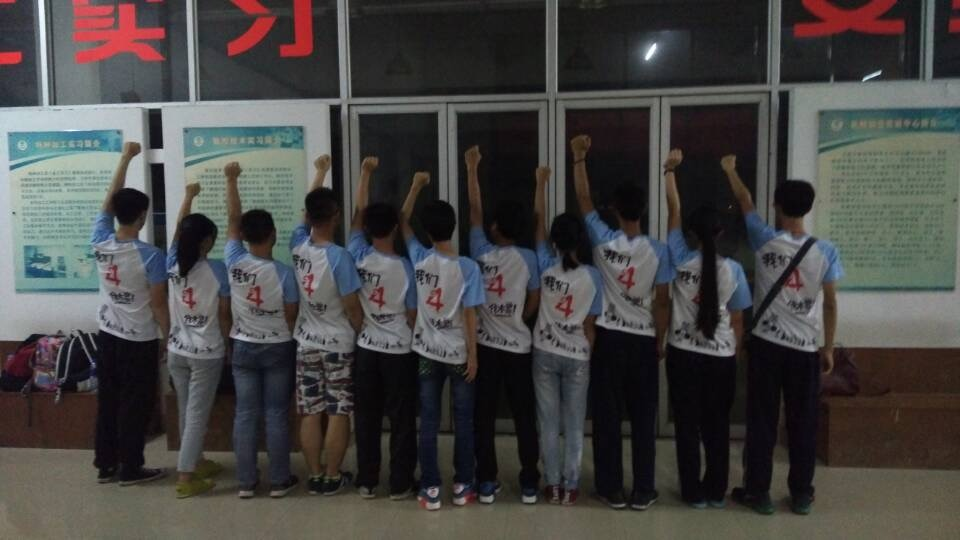
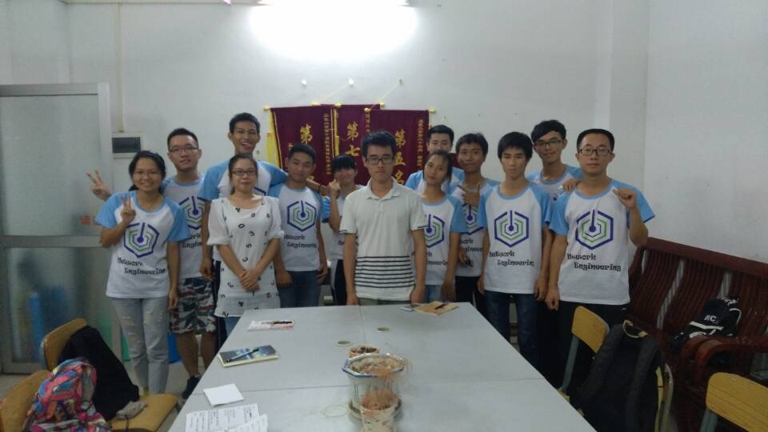
<div style="clear:both;"></div>

#### 宿舍微电影
来源：某天拿到了一张传单，得知有一个微电影比赛，主题是明辨防范传销，天明想参加，于是拉上了舍友。天明很快就写好了剧本，不断修改，最后有个雏形。

拍摄的过程很坎坷，经常CUT，因为会忍不住想笑，就算是现在回头去看视频，也还是控制不了想笑。不过拍摄用到的时间却很短，只用了2天，差不多两个中午就搞定了，很多场景和台词都是即兴发挥。摄像使用的是我的iphone6手机，在15年还是杠杆的，渲染和剪辑，压缩加字幕都交给了天明。

拿着作品去参加了比赛，最后没被选上，我看过其他人作品后，是很不服气的，入选的作品要么没打字幕，要么镜头摇摇晃晃，要么剧情简直混乱。我觉得是评选的人不会挑，那时候是真的很心痛和失望。但是这个电影是我大学珍贵的收获，冲这点就够了。后话是我们第二学期用这个视频参加了一个主题为法的微电影比赛，获得了校赛二等。

> 故事的剧情梗概是这样主角2被骗入传销，主角3为了救出主角2而潜伏在传销窝点，主角1被主角2带到传销窝点，机智的主角1和主角3一起救出了主角2

微电影链接[兄弟](https://v.qq.com/x/page/o017561h24a.html)

#### 班级活动
大一的时候，班里的凝聚力可以说是很高的，班委也很会组织活动，我也参加了很多班级的活动，像男生节包饺子，圣诞定向越野等等，这些都成为我美好的回忆。记得是在某个晚自习，我忘了为什么被叫出教室，就和班里一些同学去排练团日活动表演，现在感觉好随便，莫名就出去了。我被安排和其他人去跳一个叫小水果的广场舞，就是几个基本动作。到了表演的那天，其他班的节目比较异常严肃，而我们班的节目充满了欢乐，教室本来是沉闷氛围，结果被我们班带Hi了起来，但是团日活动应该是偏严肃的，所以最后我们班没有获奖。

在某天班里有几个人想参加义卖嘉年华节目表演，我在团日活动参加过表演，结果就被拉了进去，当时逛了AS漫展,就去进行第一次排练，当时是通过参考别人视频怎么跳，然后暂停学习，主要是参加的几个女生教，记得是排练了好久好久，她们是自己剪的音乐伴奏，我对节奏把握不是很好，就给我慢慢挑，不过真的挺快乐的，大家一起努力，虽然最后变成群魔乱舞，但是这是我大一印象最深刻的活动之一。可惜的是由于义卖嘉年华举办的时候，下着大雨，没有舞台可供我们表演，导致我们只能取消这次表演。大家说下次找其他比赛参加，或者下一年再过来参加。
<div style="clear:both;"></div>
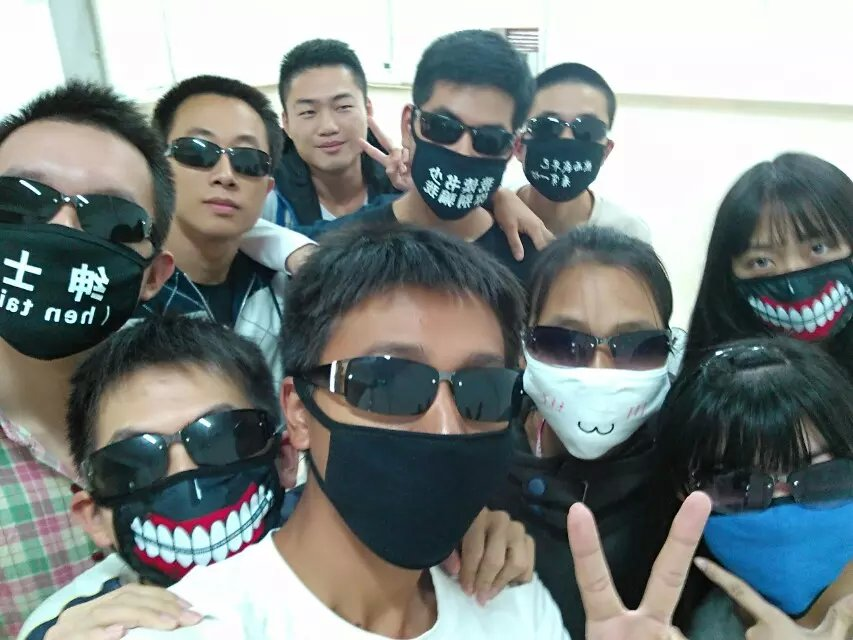
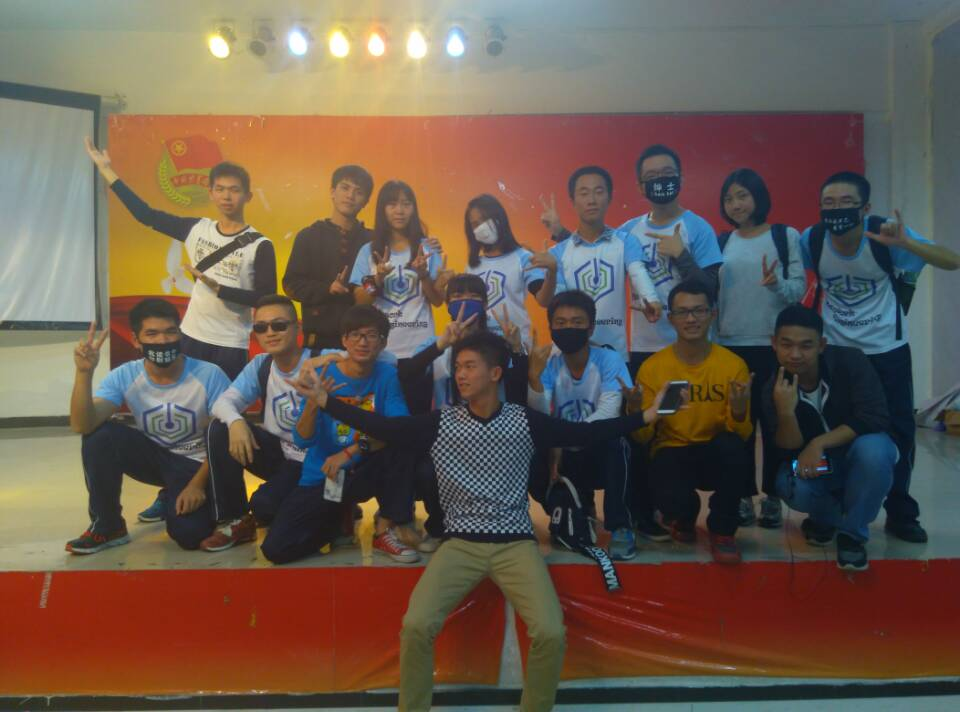
<div style="clear:both;"></div>

[义卖嘉年华表演节目视频](http://v.youku.com/v_show/id_XMTQwMTM4NTMxMg==.html?spm=a2h0k.8191407.0.0&from=s1.8-1-1.2)

后话：后来我们没有再去参加任何一次表演比赛了，大家都有了各自的事情做。在大一的下学期要举办感恩学长的活动，我们临时聚集起来，重新排练了几天，尽管发生了种种尴尬的事情，但是那天晚上的感恩学长活动我觉得举办得很好。

时隔一学期的重聚
<div style="clear:both;"></div>
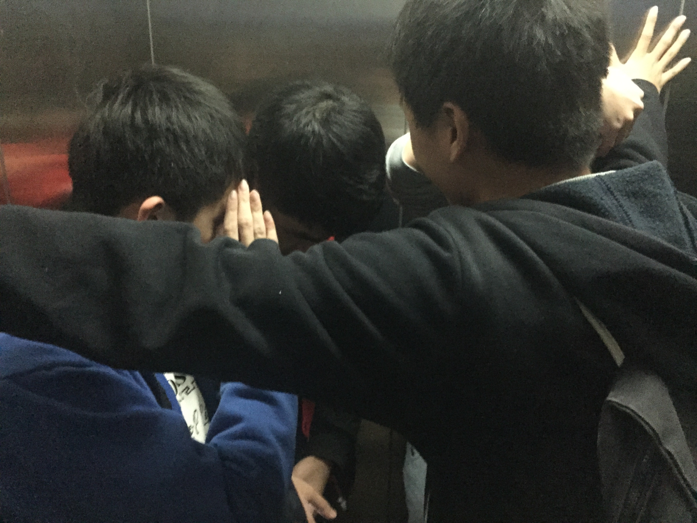
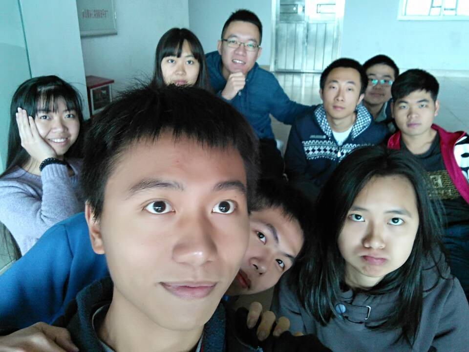
<div style="clear:both;"></div>

还有好多活动，............

#### 社团活动
参加过得社团活动就只有跆拳道社和动漫社。跆拳道社里师兄师姐们为人都不错，教人的时候都很认真，社团也有从外面请来教练，一个星期两次活动，但是学习的基本是品势，主要是偏向表演，我坚持了一个学期，后面发现没啥兴趣了就没有再去了，没有留下太深的印象和回忆。

我是动漫社的委员，参加动漫社的活动更多。前面说了，那时我的组织只有动漫社，所以我是把精力主要投放在动漫社的工作上，记得我做过的事情有发短信给参赛选手，布置学生活动东西的摆摊，派传单等等，这些几乎都是杂事，但在大一的时候，我什么都不懂，只是希望有些事做可以打发下时间，多认识一些人。

<div style="clear:both;"></div>
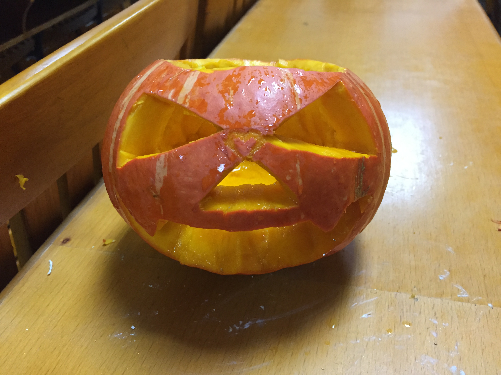

左图是举办了刻南瓜的万圣节活动，这是和舍友一起做的。这些南瓜是我们组织部到益华的负一层超市买的，抬到了马兰芳教室，在当天晚上就举办了活动，来的人还很多，大家组成小组，将南瓜挖空，刻图形，各种奇形怪状都有，也有人刻了bilibili的图案出来。当时最后有个评选优秀环节，我们没有评上，舍友说来年继续。到了来年我们却都有自己的事情做，也找不回曾经的热情去参加了。

还有一个印象深刻的活动是冬日祭，这个是动漫社组织的比较大型的活动，按社长的说法，每年收的会员的钱都烧在上面了。那时要求是每个部门都要出至少一个节目，舍友部门是演男子高中生的日常的部分片段，我们部门最后是敲定跳宅舞，舞蹈名叫blessing，我记得练习的时间持续了足足一个月，每天的中午在18楼进行练习，没有睡觉，快上课的时候就结束去上课。开始的时候有人来教，到后面主要靠自己看视频，一个动作一个动作去纠，要配合着节奏。然后还要购买统一的着装，现在感觉这套衣服有点浪费，因为平常穿不出去，布质也不是很好。到了表演的日子，我们在表演前都还在进行排练，最后表演得也很成功，努力没有白费。站上舞台时我没有紧张，反而有点享受，可能是跟同伴们在一起的原因吧，有小贤和部门的伙伴们在，才能如此淡定。

<div style="clear:both;"></div>
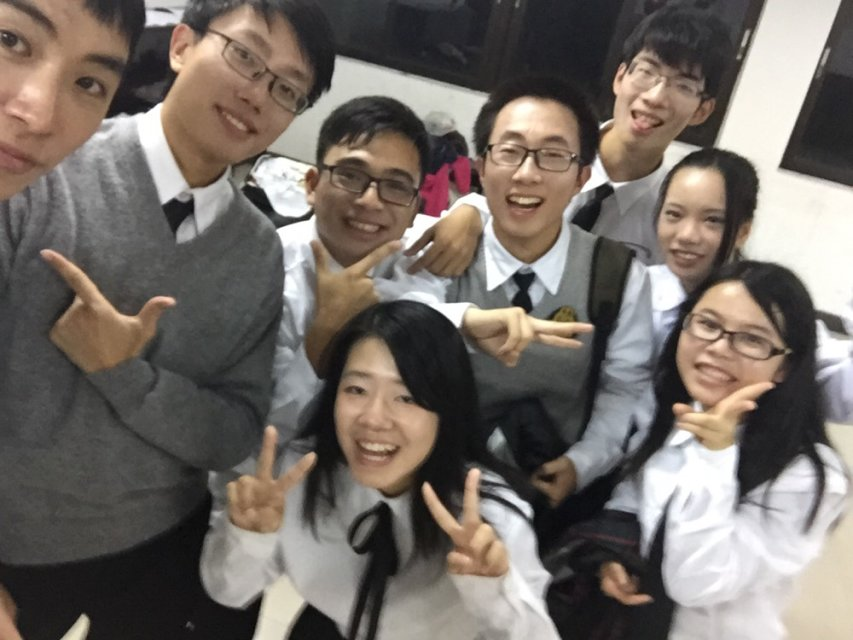
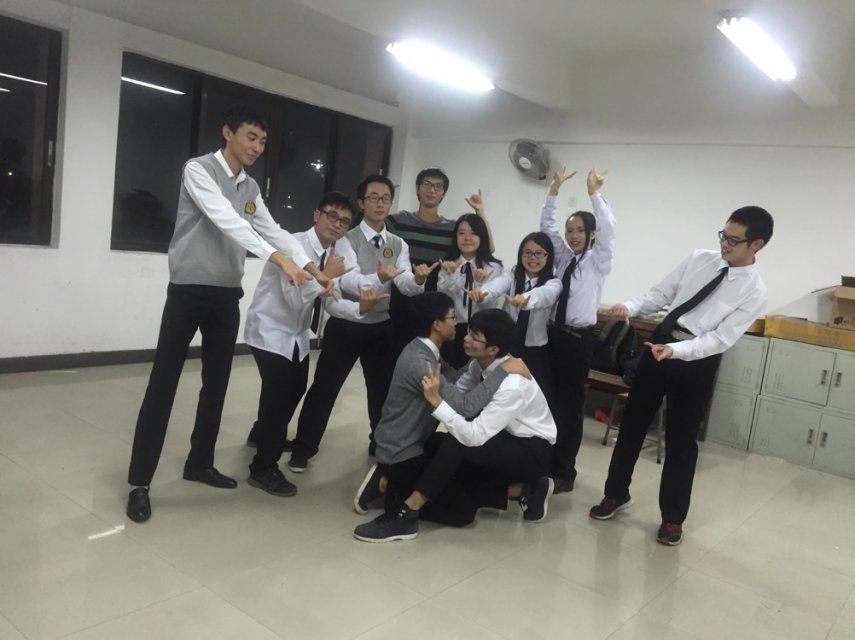
<div style="clear:both;"></div>


动漫社的活动基本上都集中在了大一上学期，到了第二学期，已经没有什么活动，我也逐渐淡出了动漫社，因为我觉得我跟动漫社的人合不过来，兴趣上不一样，加上我有了自己真正的组织。不过我还有委员的责任，没退出，我有好好完成自己的委员工作，直到委员期的结束。后话：昔日同部门的伙伴在日后也成为了动漫社的部长和社长，他们带动着动漫社的发展，看到他们的朋友圈发的，现在动漫社跟以前比多了很多活动，动漫社也在他们带领下越办越好，作为一个在动漫社待过的腊肉，我觉得很欣慰。
<div style="clear:both;"></div>


#### 加入袂卓
面试袂卓可能是我大学生涯里做的最正确的一件事情，回想当初，自己是准备过去练练手，学习面试技巧，好为下学期面试创客空间做准备，原因有如下，创客空间还有Ihat工作室，在开学初招新，但我没有去面试，有点后悔，当时周围宣传得比较厉害的是创客空间，我不了解袂卓，以为创客空间比较厉害，直到有师兄到宿舍派传单我才知道袂卓，看了传单介绍，也看到[袂卓的官网](http://meizhuo.org/)，知道这是一个集技术和创新创业的组织，觉得能对我以后的发展有很的大帮助，自己想加入。按自己的想法填了报名表，也去面试，当然，在面试前做了准备，比如了解袂卓，查看过往微博和公众号以及相关资讯，了解面试部门的情况，补习c语言知识点等等。面临的竞争很大，我所在的班级就有十多个人去面试，我到了的时候，门外就有二十多个人在等候面试，排了很久才轮到我，面试时间很短，我记得有几个问题，是问我加入工作室以后能不能退社团，我选择了拒绝，还有当有项目来时，项目和学习选哪个，我都老实回答，我以为没戏了。直到收到通过一轮的短信。可能是因为我态度比较诚恳，打动了面试官。
```
【袂卓工作室】恭喜你通过了一轮面试，请在11号星期五晚上7:30到北主楼16楼进行二轮面试，到时要带上你的手提电脑和C语言课本，尽量去查阅并学习跟C/S,B/S,服务器，浏览器相关的知识(注意，尽量去了解，并不作硬性要求)，收到请回复
```
到了二轮面试，我带了笔记本电脑和书本过去，现场是考了一些编程题，还有看我笔记本，了解我平常在做什么。面完差不多是9点多了，也不太抱有希望，但是学到了很多东西，知道自己还有很多不足的地方，收获还是比较大的。后面就是回归自己的正常生活了。

到15号和舍友参加了动漫社的自助餐聚餐，中间手机放在裤袋里，一个震动，当我拿起来看，是有一条信息，看完以后我感觉整个人非常的激动。
```
【袂卓工作室】
同学你好！恭喜你通过了二轮面试！

人生因此而改变！

本周日晚上有一次见面会  
地点：北主楼16楼沙盘
时间：晚上9点半

期待着我们人生交集的起点~
```
那时真的非常非常非常的开心和激动，迫不及待和舍友说这个消息，舍友他早早进了创客空间游戏组，他有师兄给的学习资源，加上他学习非常勤奋，给我无形中造成了很大的压力，但这样对我也很有帮助，让我不敢松懈。

我记得见面会上我还是很紧张的，看到了工作室的大佬们，也看到了跟我一起进web组的其他四个人。师兄安排让我学习前端，总共3个前端和2个后端。布置了寒假作业，也跟我们说有考核期。能不能留下就看我们自己的表现。

工作室有签到制度，一个星期不少于6次，那时刚进工作室不久，时间上已经临近期末考，HR说不用签到了，我就很少去工作室，现在觉得当初应该多去，和师兄们早点打好关系，早点融于工作室环境，有点后悔。


#### 比较有意义的寒假

在放寒假前，前端师兄给我们布置了寒假作业，就是写一篇寒假总结和完成一套静态界面。


寒假的时候要求每周写一次总结，让师兄还有自己知道这个星期学了什么东西，下个星期想学什么，当时是在[tower](https://tower.im)上写的，下面是我那时候写的第一篇，学习进度有点慢。而且写得也不够好。
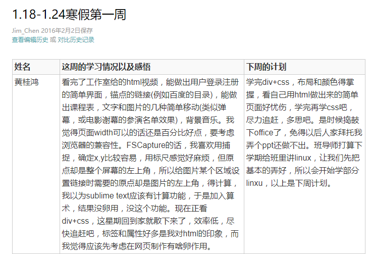

前面主要学习HTML+CSS，到寒假快结束时，开始动工静态界面和学习js，作业完成成果为[邑大书城](https://github.com/Guildhon/bookStore)。

这种学习方式还是非常有用的，可以督促自己学习，也可以了解到同组的小伙伴的学习进度，发现自己的不足等等。

#### 新学期

开学之后几周时间投入在完成c语言课程设计上了，我在第三周将其完成。

顺利通过考核，继续留在工作室学习。参加了工作室的例会，技术会，出游，聚餐，骑行，女生节，一起度过了很多开心的时光，很高兴遇到你们，Nice to meet you.

工作室总结：在工作室我学到了很多东西，认识了很多优秀的人，开拓了我的眼界，发现了自己的很多不足的地方，跟这么多优秀的人一起交流，让自己也变得优秀一点起来，在这里，我参加了很多活动，收获了很多快乐，真的很开心，大家就像一个大家庭一样。大学能认识这么一班小伙伴，真的很幸运：）

<div style="clear:both;"></div>
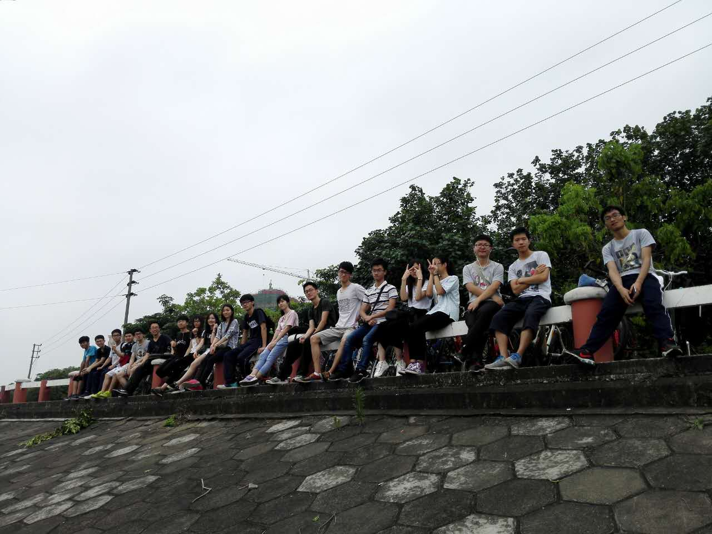
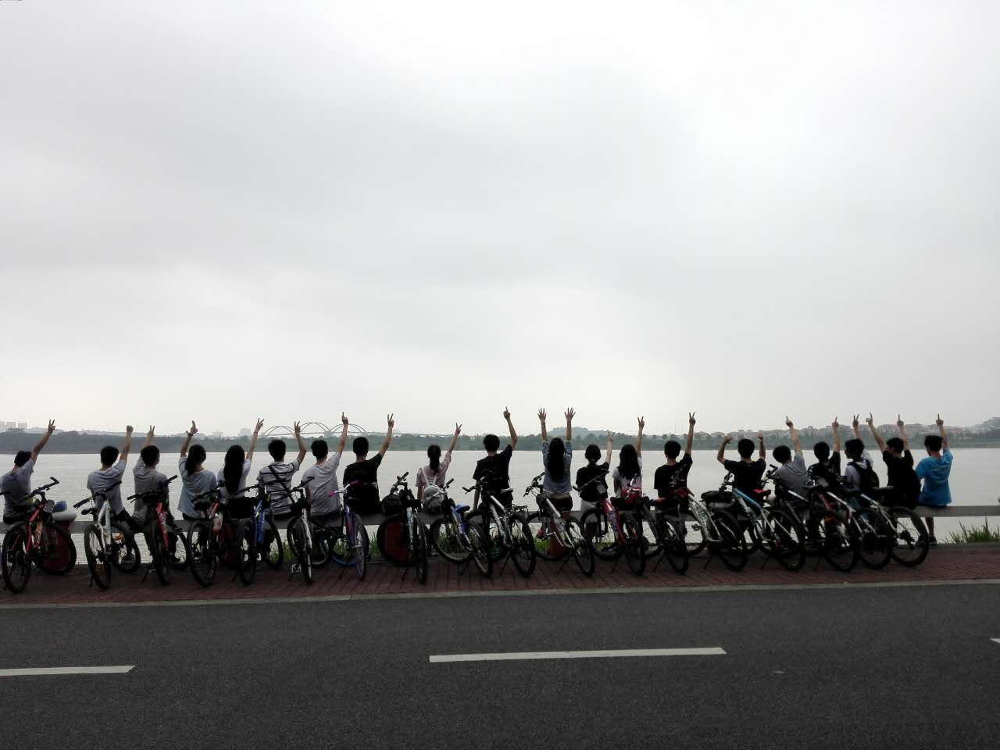
<div style="clear:both;"></div>

#### 义工
大一第一学期打算去做义教，过去面试，但那时的自己腼腆，表现不好，加上有很多面试问题回答得不好，面试效果很糟糕，落选了。第二学期参加的义工比较多，做过在东湖宣传吸烟害处的义工，看义工培训视频的义工，社区宣传活动游戏摊的义工，打扫校园的义工，唯一有意义的义工，带给我很多启发，印象最深刻的义工活动就是在康园，我学到了很多很多，思考了很多很多，越发的珍惜自己拥有的东西。
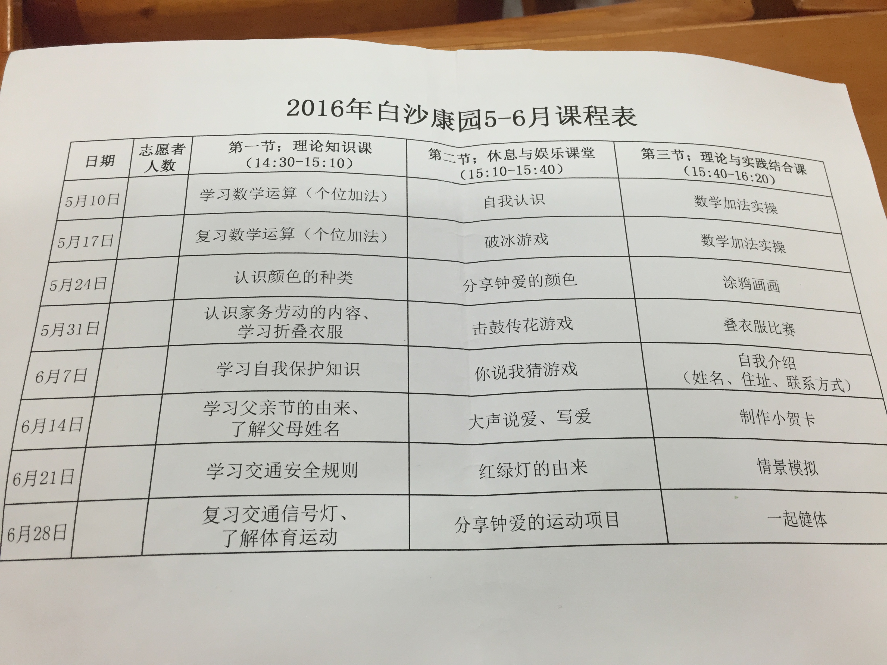

#### 期末考试
第一学期很认真的学习，有段时间很早就起床看高数，但很难坚持保持，一段时间后又懒了，平常老师布置的作业都有完成，但上课还是跟不上老师的节奏，经常听不懂老师上课在讲什么，课后的时间又去参加各种活动，各种原因导致我期中考考得很差，自己觉得需要做些改变，不然期末可能会挂科，开始恶补，考试前疯狂刷题，期末考的时候感觉还是挺简单的，考的也挺高的。到了第二学期。


#### 暑假

#### 我的大一
大一，尽管我遇到了很多很多的挫折和失败，面试部门败，面试义教败，面试学习之星败，竞选班委败，参加比赛败等等各种，但我从没气馁过，一直坚持下去，不断改正自己的缺点，努力变得优秀，正如老家一句广告词，成功不是偶然，选择才是必然，路要怎么走，还是要自己定。大一我遇到了最优秀的班级，最优秀的教官，最优秀的学长，最优秀的伙伴，对我有很深的影响，在自己的积极参与和不懈奋斗下，我的大一过得还是很充实的，已经够了。
