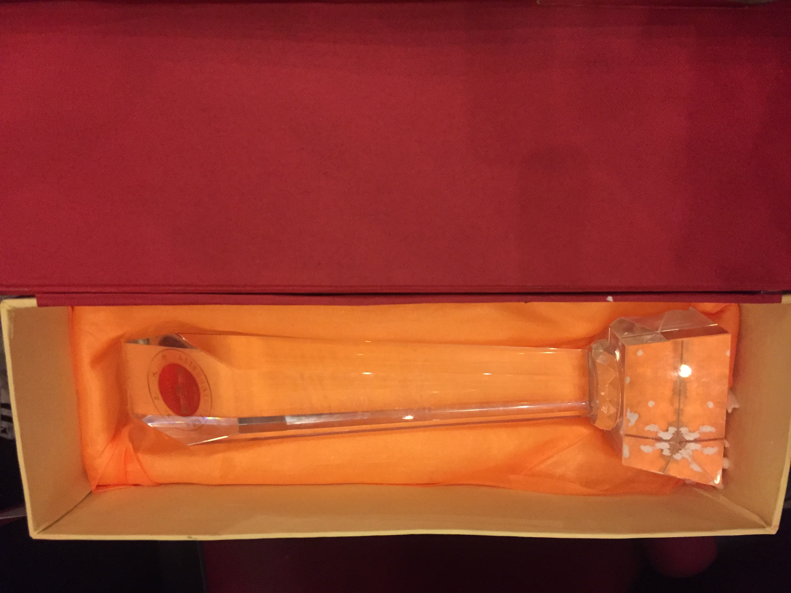

My Daily
-------- 
> 软设决赛感想  2017-12-03

昨晚是软件设计大赛的决赛时间，地点在吕志和礼堂举办。在大学里，我有几个目标想实现，一个是在毕业前能有一次站上吕志和的机会，一个是为工作室赢取一座奖杯，在昨天晚上都实现了。但是昨晚发生了一些不愉快的事情，我们工作室的五只队伍都拿到了三等，大家都不是很高兴，因为背后可能有一些不可以说的事情。

讲下自己的一些其他想法，这次决赛的队伍都比复赛进步了很多，可以看得出来练习了很多次，改掉了很多在复赛出现的毛病。我们队伍倒是没做什么额外的准备，因为我们的作品有点局限，技术上不是特别有亮点，主要还是去走了过场。昨晚终于有机会可以目睹去吕志和礼堂的后台，才发现原来吕志和真的很小。以前没有站上过，总觉得这个舞台很神秘，遥不可及。两年的观众经历让我特别想要有一次站上吕志和的机会。

昨晚我们队的PPT讲完后，就是全体上台答辩环节，出乎意料的是没有问到技术相关的，问的都是其他方面的，最后我们的答辩匆匆就完结了，在那一刻我其实已经知道结果的。结尾上台领奖的时候，Ivan派我上去领奖，我知道他不想上去拿那三等奖，他觉得已经拿过了，再拿一次没有意义，但是对我来说却很有意义，去年软设我止步复赛，带给我的打击有点大。或许是希望有一个能证明自己的机会，我没有犹豫就上去了。

最后结束我拿着奖杯和牌子，希望队友能过来合照，但没有一个队友过来，合照的都是工作室大二他们自己的队伍，我一个人在旁边反而显得很落寞，我很讨厌这种情况。去年软设我是作为观众，想和工作室获奖的队伍合照，但他们的眼里没有我，对他们来说，更想和队友合照，互相分享喜悦。没人注意到我，我也只能离开。昨晚再度上演这种状况，大四的老师兄们虽然回来了，他们也只是自嗨，大家最后草率拍了个合照，然后就没啥然后了，有点失望，我们队始终没有留下一张合照。

这个比赛我达成了几个想在工作室完成的目标，之前做项目，参加比赛获奖的目标都实现了，现在站上吕志和礼堂，为工作室拿个奖杯的目标也实现了，已经够了，我要去实现其他目标，做其他想做的事情了。一个师兄说过一句话，我觉得很有道理，不要老想着向工作室索取，而是要想着如何为工作室做贡献，工作室给予我们这么多资源，我们要学会感恩。我一直牢记这句话，也在努力为工作室做出贡献，现在随着大二的成长，大一的招新，我的使命已经差不多结束了，往后要交给新的一届了。往后的日子里要继续努力加油，要找到能和我一起努力，分享比赛快乐的队友，昨晚软设大三技术组的只有我和Ivan，显得有点落寞，队友的态度也让我有点失望。或许我更想要的是和同伴们一起艰苦奋斗，并肩战斗，一起参加比赛，一起分享获奖的喜悦吧。往后继续加油，联袂卓越吧。