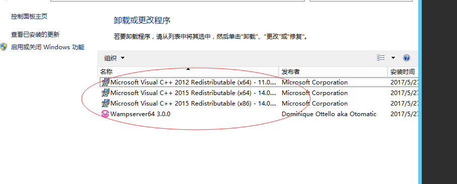

My Note
-------- 
> 服务器搭建WAMP

在安装WAMP前需要先开放安全组，解决外网无法访问服务器问题，具体可看这篇[文章](http://blog.csdn.net/qq_34881718/article/details/72784217)

在腾讯云或阿里云上windows server 2012上安装wamp后会出现丢失MSVCR100.dll的问题

这时我们需要安装Microsoft Visual C++组件，[下载官网地址](https://www.microsoft.com/zh-cn/)，以下是需要的组件

安装组件成功以后，需要进行重启，如果重启以后右下角的wamp图标没有变绿，则卸载wamp，再重新安装，这时可以看到wamp图标变绿

在wamp的www目录创建一个文件，从公网进行访问，发现不被允许访问

需要修改Apache的配置文件httpd.conf，添加一行代码，配置可从外部网络进行访问

重启Wamp的服务,这时再从公网进行访问，就可以访问了