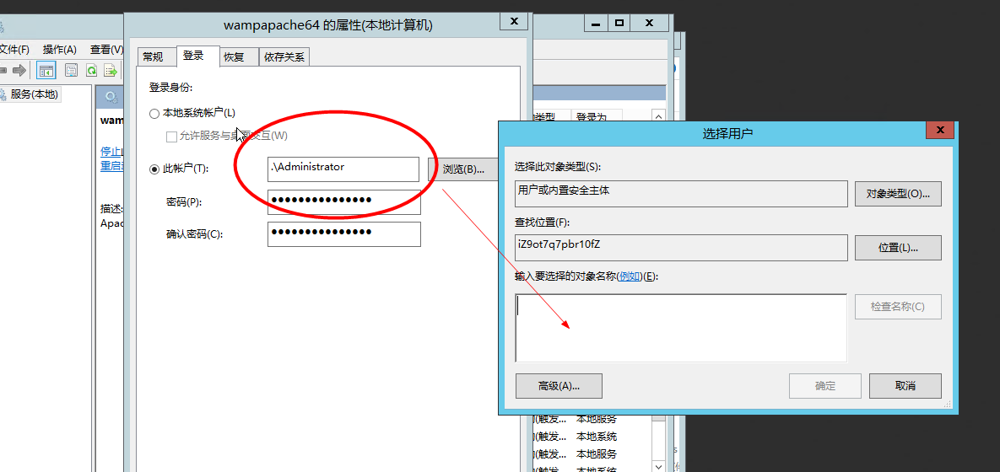

My Note
-------- 
> 配置webhook

参照[博客](https://blog.yangxitian.cn/2016/05/04/win%E4%B8%8B%E5%88%A9%E7%94%A8webhook%E5%AE%9E%E7%8E%B0%E8%87%AA%E5%8A%A8%E9%83%A8%E7%BD%B2%EF%BC%88PHP%EF%BC%89/#使用步骤)利用webhook实现自动部署进行实现

##### 制作ssh rsa key
##### 创建环境变量并创建相应的目录


##### 安装Git，执行以下命令
```
ssh-keygen -t rsa -C "youremail@example.com"
```
##### 将生成id_rsa、id_rsa.pub两个文件

##### 到coding配置远程库
将上面制作的id_rsa.pub的内容，配置到项目coding远程仓库的部署公钥上，这里我给整个账户配了SSH公钥

##### 更改apache服务器的登录用户
打开cmd，输入services.msc，启动服务

选择wampapache64右击查看属性

输入Administrator,检查名称

重启apahce服务器，可以在任务管理器看到

##### 编写项目钩子webhook.php,放到需要自动部署的项目根目录下
即在服务器上建立webhook文件，下面是文件代码，接着git init初始化
```
<?php

  //coding会以post请求发送一些认证数据，防止别人恶作剧
  //具体数据查看 https://open.coding.net/webhook.html
  //这里不能用$_POST接受，无法接收到 RAW_POST_DATA
  $json =  json_decode(file_get_contents('php://input'), true);

  //这里是一个认证的token，下面我们就会设置到
  $token = '';
  if (empty($json['token']) || $json['token'] !== $token) {
    exit('error request');
  }

  $pwd = getcwd();

  // '2>$1' 配置管道输出错误，方便调试
  // 这里已经配置了上面coding仓库的remote，并且-u 绑定了默认remote，所以直接使用'git pull'
  // 可以先输出此命令，并在cmd中运行，进行调试。
  $command = 'cd ' . str_replace('\\', '/\\', $pwd) . ' && git checkout -f && git pull 2>&1';

  echo shell_exec($command);
?>
```


在coding上建立项目，配置coding远程仓库webhook


接着在本地新建项目，git init,add,commit后，添加远程git remote add origin，git push -u origin master,推送到coding

##### 实现自动更新，服务器Git命令
```
git remote add origin  git@git.coding.net:**/testWebhook.git   //在服务器上，添加远程，
git pull origin master   									   //更新与coding数据，
git branch --set-upstream-to origin/master                     //设置关联，自动更新
```
最后本地的数据会push到coding的git仓库，coding会使服务器触发hook，从而pull代码
