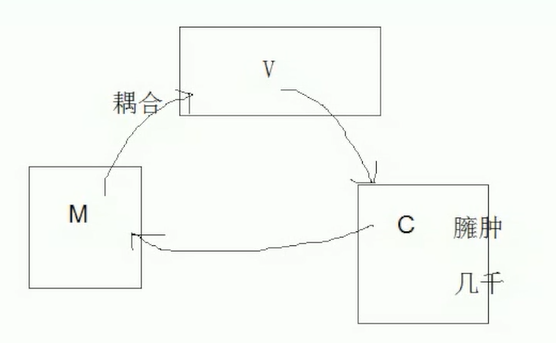
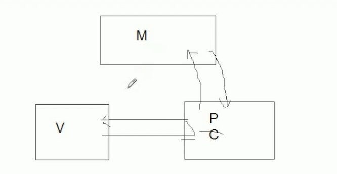

My Note
-------- 
> AngularJs学习

[AngularJS版本](https://code.angularjs.org/) 可以通过npm包管理工具，或者bower获取

脏值检查

其原理是不会去监听数据的变化，而是觉得可能要发生数据变化的时候（用户交互，DOM操作等），就去检查所有数据，看看有没有变化


AngularJS是MVVM框架
```
MVC模式
M   Model       模型-数据
V   View        视图-表现层        HTML/CSS
C   Controller  控制器-业务逻辑

V向C要数据，C通知M，M返回给V
缺点：
1.M和V耦合度高
2.C特别臃肿
```

```
MVP
M
V
P   Presenter   主持人

1.M和V没有耦合
2.P特别特别臃肿
```

```
MVVM

M
V
VM    ViewModel
1.M和V没有耦合
2.MV还好
```
```
MVC   经典
MVP   解除耦合；P臃肿
MVVM  一部分简单逻辑放到HTML里面
  取消臃肿
  直接、粗暴
```
小案例，双向数据绑定，数据与视图自动同步
```
<div ng-app="">
	<input type="text" ng-model="a">
	<div ng-bind="a"></div>
</div>
```
#### 指令
ng-app 划出angular作用范围

ng-init 初始化数据

ng-model 绑定了 HTML 表单元素到 scope 变量中，如果 scope 中不存在变量, 将会创建它。双向绑定

ng-bind 单纯输出，数据->视图

ng-repeat 循环