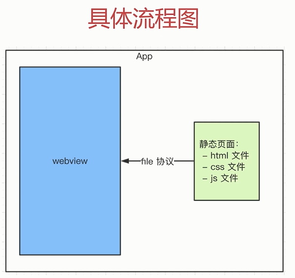
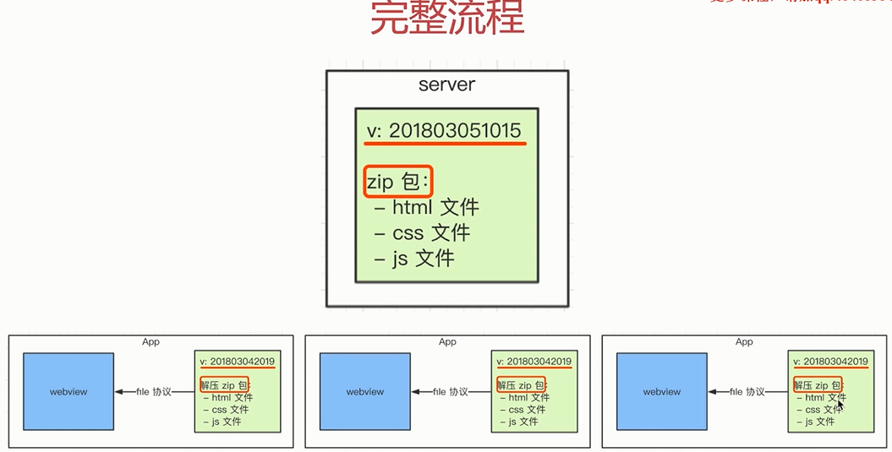
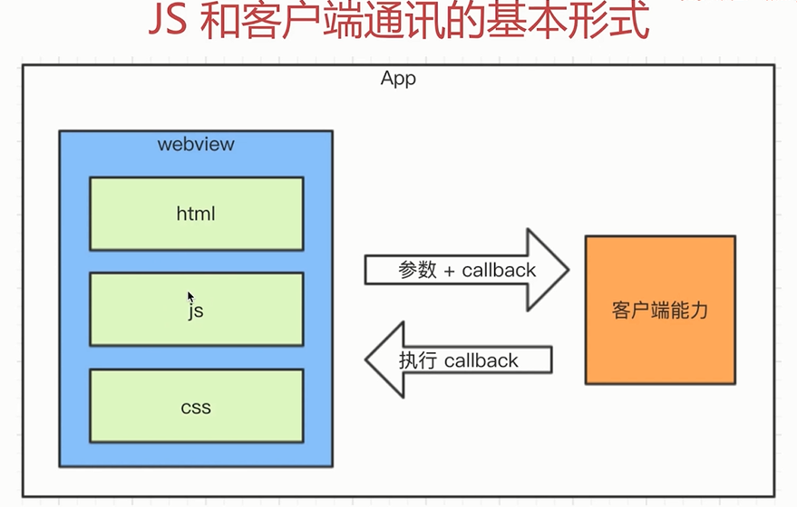

My Notes
--------
> Hybrid

移动端占大部分流量，已经远远超过PC

一线互联网公司都有自己的APP

这些APP中有很大比例的前端代码

#### bybrid是什么，为何用hybrid?

即混合，即前端和客户端的混合开发，需前端人员和客户端人员配合完成，某些环节也可能涉及到server端

可以快速迭代更新，无需app审核（纯前端代码没有权限操作，比如打开相机，获取地理位置）

体验流程（和native app体验基本类似）

减少开发和沟通成本，安卓iOS双端公用一套代码

#### webview

是app中的一个组件（app中可以由webview，也可以没有）

用于加载h5页面，即一个小型的浏览器内核

#### file协议

一开始接触html开发，就已经使用了file协议，file://  /xxx

file协议：加载本地的文件，快

http(s)协议：网络加载，慢

#### 具体实现

不是所有场景都适合使用hybrid

使用NA，体验要求极致，变化不频繁（如头条的首页）

使用hybrid，体验要求高，变化频繁（如头条的新闻详情页）

使用h5，体验无要求，不常用（如举报，反馈等页面）

实现流程：

前端做好静态页面（html,css,js），将文件交给客户端

客户端拿到前端静态页面，以文件形式存储在app中

客户端在一个webview中，使用file协议加载静态页面	



#### bybrid更新和上线的流程？

遗留问题

app发布之后，静态文件如何实时更新？

静态页面如何获取内容？

要替换每个客户端的静态文件

只能客户端来做（客户端是我们开发的）

客户端去server下载最新的静态文件

我们维护server端的静态文件



分版本，有版本号，如时间戳

将静态文件压缩成zip包，上传到客户端

客户端每次启动，都去服务端检查版本号

如果服务端版本号大于客户端版本号，就去下载最新的zip包

下载完之后解压包，然后将现有文件覆盖

#### hybrid和h5的区别？

优点：体验更好，跟NA体验基本一致，可快速迭代，无需app审核	

缺点：开发成本高，联调，测试，查bug都比较麻烦，运维成本高

hybrid：产品的稳定功能，体验要求高，迭代频繁

h5：单次的运营活动（如xx红包）或不常用功能

适用场景：hybrid适合产品型，h5适合运维型	

#### 前端JS和客户端通讯

举例，微信JS-SDK就是h5和微信之间的桥

##### JS和客户端通讯的基本形式

遗留问题：新闻详情页使用hybrid，前端如何获取新闻内容？

不能用ajax，第一，跨域（协议不同，本地file），第二，速度慢

客户端获取新闻内容（客户端可以提前获取，在点击按钮进入，页面还没加载完前，预取，不用等JS加载完再发起请求），然后JS通讯拿到内容，再渲染

类似jsonp



JS访问客户端能力，传递参数和回调函数

客户端通过回调函数返回内容

##### schema协议

页面内跳转协议

<a href="https://blog.csdn.net/ruingman/article/details/70054670">文章参考</a>

```
/* 以下是演示，无法正常运行，微信有严格的权限验证，外部页面不能随意使用schema */

var iframe = document.createElement('iframe');
iframe.style.display = 'none';
ifram.src = 'weixin://dl.scan';        // iframe 访问schema  比如扫一扫功能
var body = document.body || document.getElementsByTagName('body')[0];
body.appendChild(iframe);
setTimeout(function (){
	body.removeChild(iframe);      // 销毁iframe
	iframe = null;
});

/* 如果要加上参数和callback，那么就这么写 */
window['_weixin_scan_callback'] = function (result){
	alert(result);
}
// 省略
iframe.src = 'weixin://dl/scan?k1=v1&k2=v2&k3=v3&callback=_weixin_scan_callback'
// 省略
```

##### 内置上线