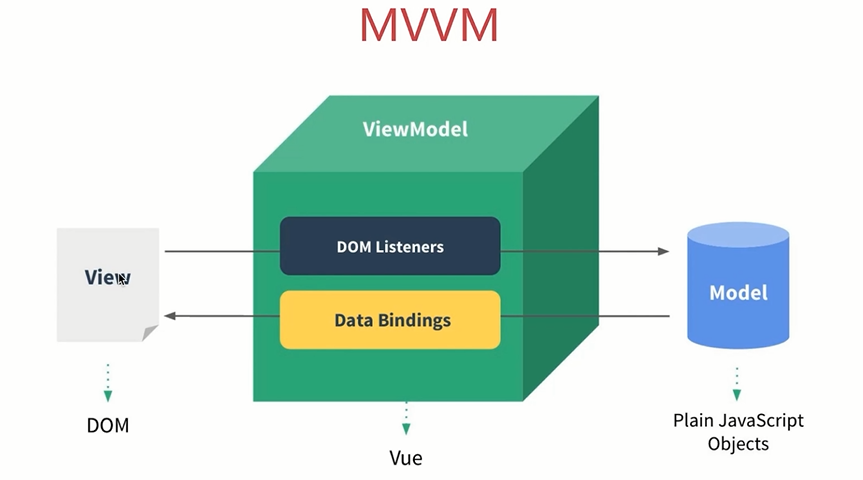

My Note
--------
> VueJs学习


[官网](https://cn.vuejs.org/)
[手册](https://cn.vuejs.org/v2/api/)


Model 模型、数据

View 视图、模板（视图和模型是分离的）

ViewModel 连接Model和View

#### MVVM三要素

响应式：vue如何监听到data的每个属性变化？

模板引擎：vue的模板如何被解析，指令如何处理？

渲染：vue的模板如何被渲染成html?以及渲染过程?

#### 一个小雏形
```
<script>
    window.onload=function(){
        new Vue({
            el:'#box',   // 选择器
            data:{
                msg:'welcome vue'
            }
        });
    };
</script>
<div id="box">
    {{msg}}
</div>
```
#### 指令，扩展HTML标签功能，属性

##### v-model 数据双向绑定
```
<input type="text" v-model="msg" />
```
##### v-for 循环
```
data: {
	arr: ['a','b','c'],
	json: {
		w: 'width',
		h: 'height'
	}
}
<li v-for="value in arr">
	{{value}}  {{$index}}
</li>
<li v-for="value in json">
	{{value}}  {{$index}} {{$key}}
</li>
<li v-for="(k,v) in json">
	{{k}}  {{v}}
</li>
```
数组有重复数据
```
<li v-for="value in arr" track-by="$index" ></li>
```
##### v-on:(click/keydown/......)    事件
```
data:{
    msg:'welcome vue'
},
methods: {
	show: function(){
		alert(this.msg);
	}
}
<input type="button" value="按钮" v-on:click="show()" />
```
简写@click
```
<input type="button" value="按钮" @click="show()" />
```
传递事件对象和其他参数
```
methods: {
	show: function(ev, a){
		alert(ev.clientX);
		alert(a);
	}
} 
<input type="button" value="按钮" @click="show($event, 12)" />
```
阻止事件冒泡
```
1.原生方法           ev.cancelBubble = true;
2.vue解决方法(stop)  @click.stop="show";
```
阻止默认行为
```
1.原生方法              ev.preventDefault();
2.vue解决方法(prevent)  @contextmenu.prevent="show";
```
键盘事件
```
// 可以ev.keyCode判断

<input type='text' @keyup.13="show">   // 判断是否是回车，也可以改成enter
```
自定义键盘信息
```
Vue.directive('on').keyCodes.ctrl = 17;
```
##### v-show 显示隐藏
```
<div v-show="true/false"></div>
```
#### 自定义指令
实现DOM操作，比如拖拽
```
// 可以传参
<script>
	Vue.directive('read', function (){
		this.el.style.background = 'red';
	});
</script>
<span v-read >123</span>
```
##### 自定义元素指令
```
Vue.elementDirective('zns-red', function(){
	bind: function(){
		......
	}
});
<zns-red></zns-red>
```
#### 属性 
##### v-bind:(src)
```
   // 使用src="{{url}}"会报404错误
```
简写
```

```
##### 特殊:class
```
<style>
    .red{
        color: red;
    }
    .blue{
        background: blue;
    }
</style>
<div id="box">
    <strong :class="[red]">文字...</strong>
</div>
<script>
window.onload=function(){
    new Vue({
        el:'#box',
        data:{
            red:'red'
        }
    });
};
</script>
```
```
<style>
    .red{
        color: red;
    }
    .blue{
        background: blue;
    }
</style>
<strong :class="{red:true,blue:true}">文字...</strong>
```
##### 特殊:style
```
<strong :style="{color:'red'}">文字...</strong>
```
```
data:{
    c:{color:'red'},
    b:{backgroundColor:'blue'}    // 驼峰命名法
}
<strong :style="[c,b]">文字...</strong>
```
#### 模板
```
{{msg}}   // 双向绑定，数据更新模板变化
{{*msg}}  // 数据只绑定一次，数据更新模板不变
{{{msg}}} // 解析HTML标签输出
```
#### 过滤器
```
{{'abc'|uppercase}} // 字符串转大写
```
##### 自定义过滤器
```
<div>
	{{a | toDou 1}}
</div>
<script>
	Vue.filter('toDou', function(input, a){
		console.log(a);   // 1
		return input < 10 ? '0' + input : input;
	});
</script>
```
双向过滤器
```
// model -> view
// view  -> model
Vue.filter('xxx', function (){
	read: function (input){    // model -> view

	},
	write: function (val){	  // view  -> model	

	} 
});
```
#### 交互
vue-resouce
get获取数据，发送数据通过第二个参数data
```
this.$http.get('a.txt',data,{}).then(function(res){
    alert(res.data);
},function(res){
    alert(res.data);
});
```
post需要设置
```
this.$http.post('post.php',{
    a:1,
    b:20
},{
    emulateJSON:true
}).then(function(res){
    alert(res.data);
},function(res){
    alert(res.status);
});
```
#### 生命周期
vue1.x
```
created               实例已经创建
beforeCompile         编译之前
compiled			  编译之后
ready  		       插入到文档中

beforeDestroy		  销毁之前
destroyed			  销毁之后	
```
#### 防止闪烁
防止用户看见花括号标记
```
// vue2.x已经删掉
<style type="text/css">
	[v-clock] {
		display: none;
	}
</style>
<div v-cloak >
	{{msg}}
</div>
```
另一种方法
```
<div v-text="msg" ></div>
```
```
<div v-html="msg" ></div>
```

#### 计算属性
```
// a和b都是vue实例的属性
// 当a数据变化时b会跟着变化
data: {
	a: 1
},
computed: {
	b: function (){
		return this.a + 1;
	}
}
```
b里面有两个默认方法
```
b: {
	get: function(){
		return this.a + 1;   // 默认调用get
	},
	set: function(val){
		alert(val);  // 10
	}
}
document.onclick = function () {
	vm.b = 10;
}
```
#### vue实例简单方法
```
vm.$el         元素el
vm.$data       data
vm.$options    可以访问实例的自定义属性
vm.$destroy()  销毁对象
vm.$log()      查看data状态
```
如果在new Vue里面不使用el的话
```
vm.$mount('#box');   // 手动挂载vue程序
```
#### 监听数据变化
```
data: {
	a: 1,
	b: {
		name: 'guildhon'
	}
}
// 浅度
vm.$watch('a' function(){

});
// 深度，可以监听json
vm.$watch('a' function(){

}, {
	deep: true
});
```
#### 过渡（动画）
本质走的是CSS3动画:transition,animation
```
<style>
	.fade-transition{
		transition: 1s all ease;
	}
	.fade-enter{
		opacity: 0;
	}
	.fade-leave{
		opacity: 1;
	}
</style>
<div v-show="bSign" transition="fade"></div>
```
配合animate.css使用
```
Vue实例里面
<div v-show="bSign" transition="fade"></div>
transitions: {
	fade: {
		enterClass: '',
		leaveClass: ''
	}
}
```
#### 组件
全局组件
```
<div id="box">
	<aaa></aaa>
</div>
var Aaa = Vue.extend({
	template: '<h3>我是标题</h3>'
});
Vue.component('aaa',Aaa);
```
组件中放数据
```
var Aaa = Vue.extend({
	data(){
		return {
			msg: 123
		}
	},
	template: '<h3>{{msg}}</h3>'
});
```
组件中加事件
```
// data必须是个函数，返回json
var Aaa = Vue.extend({
	data(){
		return {
			msg: 123
		}
	},
	methods: {
		change(){
			this.msg = 'abc'
		}
	},
	template: '<h3 @click="change">{{msg}}</h3>'
});
```
局部组件
```
var Aaa = Vue.extend({
	data(){
		return {
			msg: 123
		}
	},
	methods: {
		change(){
			this.msg = 'abc'
		}
	},
	template: '<h3 @click="change">{{msg}}</h3>'
});
var vm = new Vue({
	el: '#box',
	data: {

	},
	components: {
		aaa: Aaa
	}
})
```
也可以直接使用
```
Vue.component('my-aaa',{
	template: '<strong>strong</strong>'
});
```
```
var vm = new Vue({
	el: '#box',
	data: {

	},
	components: {
		'my-aaa': {
			template: '<h1>Big</h1>'
		}
	}
})
```
将template的东西抽到其他地方
```
<div id="box">
	<my-aaa></my-aaa>
</div>
<script type="x-template" id="aaa">
	<h1>{{msg}}</h1>
</script>
<script>
	var vm = new Vue({
		el: '#box',
		data: {

		},
		components: {
			'my-aaa': {
				data(){
					return {
						msg: 'test data'
					}
				},
				template: '#aaa'
			}
		}
	})
</script>
```
也可以
```
<template id="aaa">
	<h1>{{msg}}</h1>
</template>
```
动态组件
```
<component :is="组件"></component>
```
父子组件
```
components: {
	'aaa': {
		data(){
			return {
				msg: '父组件数据'
			}
		},
		template: '<h1>aaa组件</h1><bbb></bbb>',
		components: {
			'bbb': {
				template: '<h2>bbb</h2>'
			}
		}
	}
}
```
组件数据传递
```
<div id="box">
	<aaa></aaa>
</div>
<template id="aaa">
	<h1>aaa组件->{{msg}}</h1>
	<bbb :m="msg"></bbb>
</template>
<script>
	var vm = new Vue({
		el: '#box',
		data: {

		},
		components: {
			'aaa': {
				data(){
					return {
						msg: '父组件数据'
					}
				},
				template: '#aaa',
				components: {
					'bbb': {
						props: ['m'],
						template: '<h2>子组件拿到->{{m}}</h2>'
					}
				}
			}
		}
	})
</script>
```

#### vue中如何实现响应式

什么是响应式？

修改data属性之后，vue立即监听到

data属性被代理到vm(this)上

```
<!DOCTYPE html>
<html lang="en">
<head>
	<meta charset="UTF-8">
	<title>Document</title>
</head>
<body>
	<div id="app">
		<p>{{name}}</p>
		<p>{{age}}</p>
	</div>
	<script src="https://cdn.bootcss.com/vue/2.5.16/vue.min.js"></script>
	<script>
		var vm = new Vue({
			el: '#app',
			data: {
				name: '张三',
				age: 20
			},
			methods: {
			}
		})
		vm.name = "李四";
	</script>
</body>
</html>
```
Object.defineProperty
```
var _name = "张三";  // _认为是内部变量
var obj = {};
Object.defineProperty(obj, "name", {
	get: function () {
		console.log('get');
		return _name;
	},
	set: function (newValue){
		console.log('set');
		_name = newValue
	}
})
```		
模拟实现
```
var mv = {};
var data = {
	price: 100,
	name: 'zhangsan'
}
var key,value;
for (key in data) {
	// 命中闭包。新建一个函数，保证key的独立的作用域
	(function (key){
		Object.defineProperty(mv, key, {
			get: function (){
				console.log('get');
				return data[key];
			},
			set: function (newVal){
				console.log('set');
				data[key] = newVal;
			}
		})
	})(key);
}
```

#### vue中如何解析模板
本质：字符串

有逻辑，如v-if,v-for等

与html格式很像，但有很大区别

最终要转换为html来显示

模板最终必须转换成JS代码，因为：有逻辑（v-if,v-for），必须用JS才能实现（图灵完备）；转换为html渲染页面，必须用JS才能实现。因此，模板最重要转换成一个JS函数（render函数）

##### render函数
with用法
```
var obj = {
	name: 'zhangsan',
	age: 20,
	getAddress: function (){
		alert('beijing');
	}
}
// 不用with
function fn(){
	alert(obj.name);
	alert(obj.age);
	obj.getAddress();
}
fn();

// 使用width
function fn1(){
	with(obj) {
		alert(name);     // 可读性不好
		alert(age);
		getAddress();
	}
}
fn1();
```

模板中所有信息都包含在render函数中

this即vm

price即this.price即vm.price,即data中的price

_c即this._c即vm._c

```
<div id="app">
	<p>{{price}}</p>
</div>

// 对应js
with(this){
	return _c(
		'div',
		{
			attrs: {
				"id": "app"
			},
		},
		[
			_c('p',[_v(_s(price))]) // _s转化为字符串，类似toString，_v是创建文本节点
		]	
	)
}
```
要进行以上的转换

到了vue2.0开始支持预编译

开发环境：写模板

编译打包：

生产环境：js

在vue1.x时，打包的依旧是html模板，需要考虑模板到render的过程

到2.x时，支持预编译，将其转化为js，更重要的是考虑render到模板的过程

React组件化也是一样道理，将JSX模板 编译->JS代码，JSX语法变成标准，工具化的原理不需要知道

```
// vue-todo应用
<!DOCTYPE html>
<html lang="en">
<head>
	<meta charset="UTF-8">
	<title>todo</title>
</head>
<body>
	<div id="app">
		 <div>
	        <input type="text" v-model="textTitle">
	        <button id="btn-submit" @click="addList">submit</button>
	    </div>
	    <div>
	        <ul id="ul-list">
	        	<li v-for="item in list">{{item}}</li>
	        </ul>
	    </div>
	</div>
	<script src="vue.js"></script>
	<script>
		var vm = new Vue({
			el: '#app',
			data: {
				textTitle: '',
				list: []
			},
			methods: {
				addList: function () {
					if (!this.textTitle) {
						return;
					}
					this.list.push(this.textTitle);
					this.textTitle = "";
				}
			}
		})
	</script>
</body>
</html>
```
render函数

这里_c其实就相当于snabbdom的h函数

render函数执行之后，返回的是vnode
```
with(this){
	return _c(
		'div',
	    {
	    	attrs:{"id":"app"}
	    },
	    [
	    	_c(
	    		'div',
	    		[
	    			_c(
	    				'input',
	    				{
	    					directives:[
	    						{
	    							name:"model",
	    							rawName:"v-model",
	    							value:(textTitle),       // 对应vm.textTitle
	    							expression:"textTitle"
	    						}
	    					],
	    					attrs:{"type":"text"},
	    					domProps:{
	    						"value":(textTitle)
	    					},
	    					on:{
	    						"input":function($event){      // 双向数据绑定，触发事件 v->m
	    								if($event.target.composing)return;
	    								textTitle=$event.target.value
	    						}
	    					}
	    				}
	    			),
	    			_v(" "),
	    			_c(
	    				'button',
	    				{
	    					attrs:{
	    						"id":"btn-submit"
	    					},
	    					on:{
	    						"click":addList
	    					}
	    				},
	    				[
	    					_v("submit")
	    				]
	    			)
	    		]
	    	),
	    	_v(" "),
	    	_c(
	    		'div',
	    		[
	    			_c(
	    				'ul',
	    				{
	    					attrs:{"id":"ul-list"}
	    				},
	    				_l(
	    					(list),
	    					function(item){
	    						return _c(
	    								'li',
	    								[_v(_s(item))]
	    						)
	    					}
	    				)
	    			)
	    		]
	    	)
	    ]
	)
}
```
updateComponent中实现了vdom的patch

页面首先渲染执行了updateComponent

data每次修改属性，执行updateComponent

```
vm._update(vnode){
	const prevVnode = vm._vnode;
	vm._vnode = vnode;
	if (!prevVnode) {
		vm.$el = vm.__patch__(vm.$el,vnode);
	} else {
		vm.$el = vm.__patch__(prevVnode,vnode);
	}
}
function updateComponent(){
	// vm._render即上面的render函数，返回vnode
	vm._update(vm.render());
}
```
vue的整个实现流程

1.解析模板成render函数 （with用法，模板中所有信息都被render函数包含，模板中用到的data属性，都变成了JS变量，模板中的v-model,v-for,v-on都变成了JS逻辑，render函数返回vnode）

2.响应式开始监听 （Object.defineProperty，将data的属性代理到vm上）

3.首次渲染，显示页面，且绑定依赖 （初次渲染，执行updateComponent，执行vm.render()，执行render函数，会访问到vm.list和vm.title，会被响应式的get方法监听到，执行updateComponent,会走到vdom的patch方法，patch将vnode渲染成DOM，初次渲染完成）（绑定依赖监听get，不直接监听set，data有很多属性，有些被用到，有些可能不被用到，被用到的会走get，不被用到的不会走get，未走get中的属性，set的时候我们也无需关心，避免不必要的重复渲染，比如data里有个aaa:12，但是模板没有使用到，即不走get监听，以后对它进行修改，走set监听，不管它）

4.data属性变化，触发rerender （修改属性，被响应式的set监听到，set中执行updateComponent，updateComponent重新执行vm._render()，生成的vnode和prevVnode，通过patch进行对比，渲染到html中）


