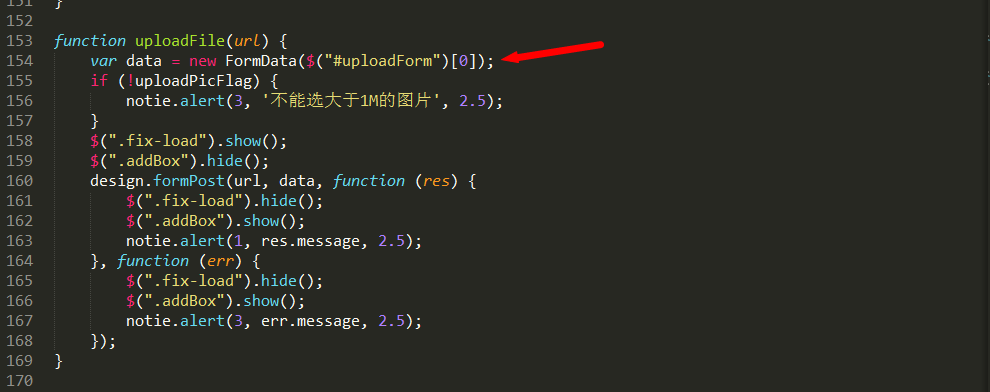
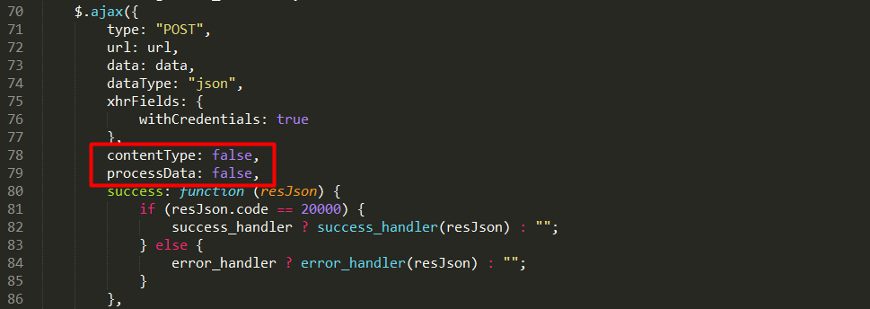

My Note
--------
> 我遇到的坑

- ##### 在做国雅项目时，做的是手机web，设计了一个底部导航为display:fixed的布局方法，之后发现在聚焦input框时，安卓系统的手机，网页底部导航会随着软键盘的出现而被顶上去，下面是我的一个解决方案

```
var old = document.documentElement.clientHeight;
window.onresize = function () {
    if (old > document.documentElement.clientHeight) {
        $(".ui-footer").hide();
    } else {
        $(".ui-footer").show();
    }
};
```
- ##### 跨域使用CORS时，前端的ajax代码需要添加下列代码，[跨域解决教程之CORS](https://blog.yangxitian.cn/2016/05/04/JS-API%E8%B7%A8%E5%9F%9F%E8%A7%A3%E5%86%B3%E4%B9%8BCORS/)

```
//开启携带认证信息，默认为关闭
xhrFields: {
  	withCredentials: true
}
```

- ##### 利用HTML5的formData实现ajax上传，这里由于使用了jquery，需要原生对象，转化$("#uploadForm")[0]，还需要在jquery的ajax里面设置contentType: false,processData: false

processData的默认值是true，用于对data参数进行序列化处理，发送的数据将被转换为对象（从技术角度来讲并非字符串）以配合默认内容类型"application/x-www-form-urlencoded"。如果要发送DOM树信息或者其他不希望转换的信息，请设置为false。ajax 中 contentType 设置为 false 是为了避免 JQuery 对其操作，从而失去分界符，而使服务器不能正常解析文件。




- ##### URI 组件中含有分隔符，比如 ? 和 #，则应当使用 encodeURIComponent() 方法分别对各组件进行编码

该方法不会对 ASCII 字母和数字进行编码，也不会对这些 ASCII 标点符号进行编码： - _ . ! ~ * ' ( )

encodeURIComponent() 函数 与 encodeURI() 函数的区别之处，前者假定它的参数是 URI 的一部分（比如协议、主机名、路径或查询字符串）。因此 encodeURIComponent() 函数将转义用于分隔 URI 各个部分的标点符号

- ##### 作用域问题，在ES5里面的变量只有函数作用域，没有块级作用域，在ES5一般是用函数解决的，ES6则可以使用let

```
var aBtn = document.getElementsByTagName("button");
for (var i = 0; i < aBtn.length; i++) {
	aBtn[i].onclick = (function (i) {
		return function () {
				alert(i);
			}
	})(i);
}
```