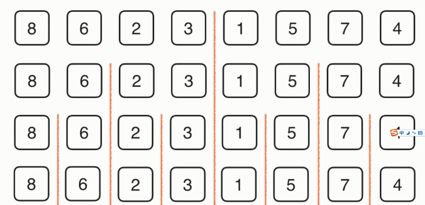
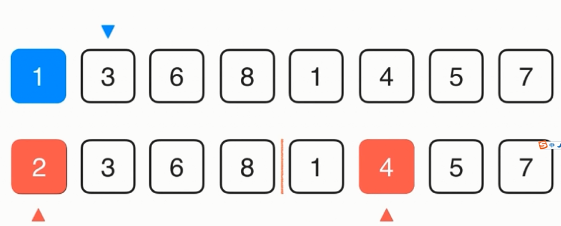

My Note
-------- 
> 归并排序

以[8,6,2,3,1,5,7,4]为例,N为元素个数，时间复杂度为Nlog(N)，进行log(N)轮二分，再使用时间复杂度为N的方法归并。缺点是多使用了存储空间，需要使用O(N)额外的空间。
首先递归，直到不能分解。

自底向上依次归并，如下图，使用k指向arr,下面为aux，即arr的备份，分别使用i,j指向其左右两边，如1，2两个数判断谁小，小的赋值给arr[k]，k++，j++，继续比较2和4依此类推。

```
// Javascript
var arr = [8,6,2,3,1,5,7,4];
function __merge(arr,l,mid,r){
	var aux = [];
	for (var i = l; i <= r; i++) {
		aux[i] = arr[i];
	}
	var i = l, j = mid + 1;
	for (var k = l; k <= r; k++)
	{
		if (i > mid) {
			arr[k] = aux[j];
			j++;
		} else if (j > r) {
			arr[k] = aux[i];
			i++;
		} else if (aux[i] < aux[j]) {
			arr[k] = aux[i];
			i++;
		} else {
			arr[k] = aux[j];
			j++;
		}
	}
}
// 递归使用归并排序，对arr[l...r]的范围进行排序
function __mergeSort(arr,l,r){
	if (l >= r) {
		return;
	} 
	var mid = parseInt((l + r) / 2); 
	__mergeSort(arr,l,mid);
	__mergeSort(arr,mid + 1,r);
	__merge(arr,l,mid,r);
}
function mergeSort(arr){
	__mergeSort(arr,0,arr.length-1)
	console.log(arr);
}
mergeSort(arr);
```
改进，数组近乎有序时的优化
```
function __mergeSort(arr,l,r){
	if (l >= r) {
		return;
	} 
	var mid = parseInt((l + r) / 2); 
	__mergeSort(arr,l,mid);
	__mergeSort(arr,mid + 1,r);
	// 判断arr[mid]是否大于arr[mid+1]，成立则需要merge，不成立不需要merge
	if (arr[mid] >  arr[mid + 1]) {
		__merge(arr,l,mid,r);
	}
}
```
再改进，当数组值够小的时候，出现有序的概率会比较大，可以使用插入排序
```
function __mergeSort(arr,l,r){
	// 当小于15时使用插入排序
	if (r - l <= 15) {
		insertionSort(arr,l,r);
		return ;
	} 
	var mid = parseInt((l + r) / 2); 
	__mergeSort(arr,l,mid);
	__mergeSort(arr,mid + 1,r);
	// 判断arr[mid]是否大于arr[mid+1]，成立则需要merge，不成立不需要merge
	if (arr[mid] >  arr[mid + 1]) {
		__merge(arr,l,mid,r);
	}
	
}
```
前面都是自顶向下的归并排序，下面是自底向上的归并排序。
```
function __merge(arr,l,mid,r){
	var aux = [];
	for (var i = l; i <= r; i++) {
		aux[i] = arr[i];
	}
	var i = l, j = mid + 1;
	for (var k = l; k <= r; k++)
	{
		if (i > mid) {
			arr[k] = aux[j];
			j++;
		} else if (j > r) {
			arr[k] = aux[i];
			i++;
		} else if (aux[i] < aux[j]) {
			arr[k] = aux[i];
			i++;
		} else {
			arr[k] = aux[j];
			j++;
		}
	}
}
function mergeSortBU(arr){
	var n = arr.length;
	// size为元素个数
	for (var size = 1; size <= n; size = 2 * size) {
		// 归并过程应该要有两部分，所以i+size<n
		for (var i = 0; i + size < n; i = i + size * 2) {
			if (i + size + size - 1 > n - 1) {
	 			__merge(arr,i,i + size - 1,n - 1);
			} else {
	 			__merge(arr,i,i + size - 1,i + size + size - 1);
			}
		}
	}	
}
var arr = [3,0,5,1,-2,0,2];
mergeSortBU(arr);
console.log(arr);
```
