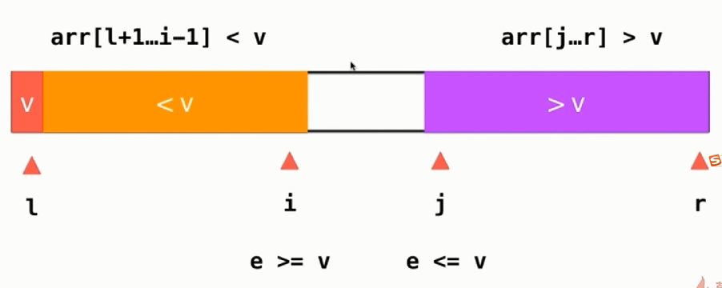
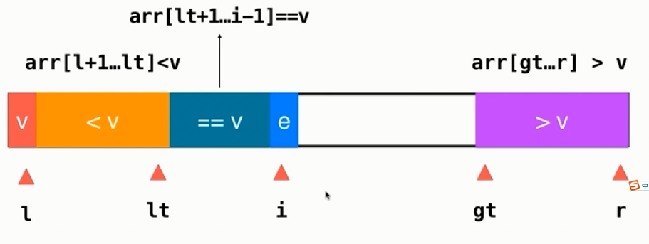

My Note
-------- 
> 快速排序

取数组下标为l的值，从l+1到r开始遍历,设置j为指向小于l的范围的最后一个值，假如有小于下标l的值，调换arr[j]与arr[j+1]之间的值。交换完成返回继续进行左边和右边的快速排序。
```
var arr = [1,5,-2,3,4];
function swap(arr,i,j){
	var temp = arr[j];
	arr[j] = arr[i];
	arr[i] = temp;
}
function __quickSort(arr,l,r){
	if (l >= r) {
		return ;
	} 
	var p = __partition(arr,l,r);
	__quickSort(arr,l,p - 1);
	__quickSort(arr,p + 1,r);
}
function __partition(arr,l,r){
	var v = arr[l];
	var j = l;
	for (var i = l + 1; i <= r; i++) {
		if (v > arr[i]) {
			j++;
			swap(arr,i,j)
		}
	}
	swap(arr,l,j)
	return j;
}

__quickSort(arr,0,arr.length-1);
console.log(arr);
```
优化，当数组值够小的时候，出现有序的概率会比较大，可以使用插入排序
```
function __quickSort(arr,l,r){
	// 当小于15时使用插入排序
	if (r - l <= 15) {
		insertionSort(arr,l,r);
		return ;
	} 
	var p = __partition(arr,l,r);
	__quickSort(arr,l,p - 1);
	__quickSort(arr,p + 1,r);
}
```
优化，随机选取第一个的数
```					
function randomNum(i,j){
	var c = j - i + 1;
	// Math.random()大于等于 0.0 且小于 1.0 
	return Math.floor(Math.random() * c + i);
}
function __partition(arr,l,r){
	var rand = randomNum(i,j);
	swap(arr,l,rand);				// 交换下标为l和rand的值
	var v = arr[l];

	var j = l;
	for (var i = l + 1; i <= r; i++) {
		if (v > arr[i]) {
			j++;
			swap(arr,i,j)
		}
	}
	swap(arr,l,j)
	return j;
}
```

双路快速排序，当有大量重复的数时能够均衡一点

```
function __partition2(arr,l,r){
	var rand = randomNum(l,r);
	swap(arr,l,rand);
	var v = arr[l];
	// arr[l+1...i]<=v arr[j...v]>=v
	var i = l + 1,j = r;
	while (true) {
		while (i <= r && arr[i] < v) i++;
		while (j >= l + 1 && arr[j] > v) j--;
		if (i > j) break;
		swap(arr,i,j);
		i++;
		j--;
	}
	swap(arr,l,j);
	return j;
}
```
三路快速排序

```
var arr = [3,5,1,0,4,-2,0,3,-10];
function randomNum(i,j){
	var c = j - i + 1;
	return Math.floor(Math.random() * c + i);
}
function swap(arr,i,j){
	var temp = arr[j];
	arr[j] = arr[i];
	arr[i] = temp;
}
function __quickSort3Ways(arr,l,r){
	// partition
	var rand = randomNum(l,r);
	swap(arr,l,rand);
	var v = arr[l];
	var lt = l;   // arr[l+1...lt] < v
	var gt = r + 1; // arr[gt...r] > v
	var i = l + 1; // arr[lt+1...i] == v
	while (i < gt) {
		if (arr[i] < v) {
			swap(arr,i,lt+1);
			lt++;
			i++; 
		} else if (arr[i] > v) {
			swap(arr,i,gt-1);
			gt--;
		} else {
			// arr[i] == v
			i++;	 
		}
	}
	swap(arr,l,lt);
	__quickSort3Ways(arr,l,lt-1);
	__quickSort3Ways(arr,gt,r);
}
__quickSort3Ways(arr,0,arr.length-1);
console.log(arr);
```