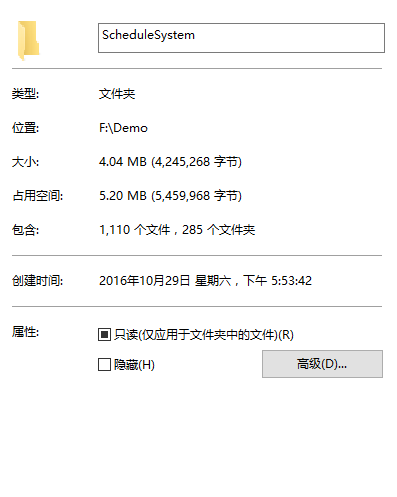
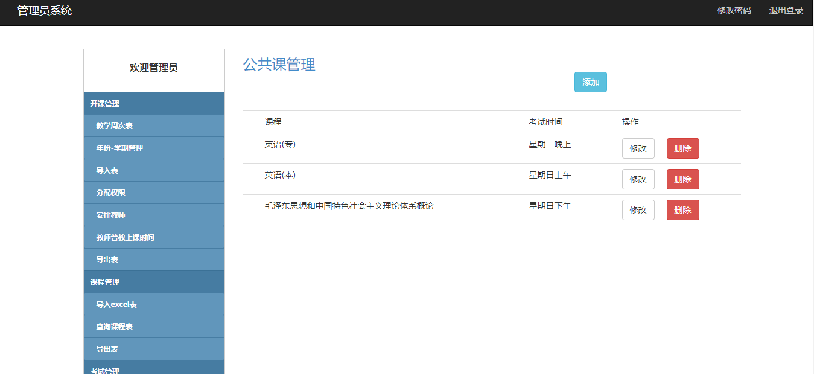
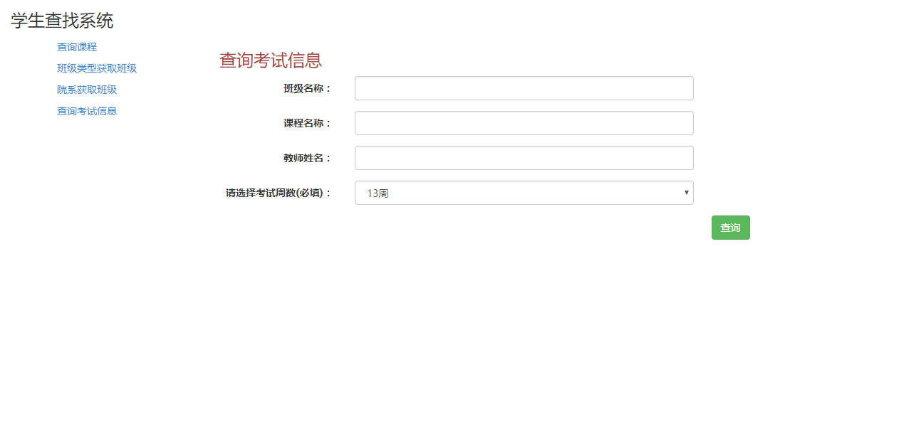
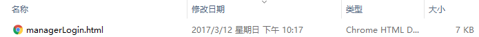
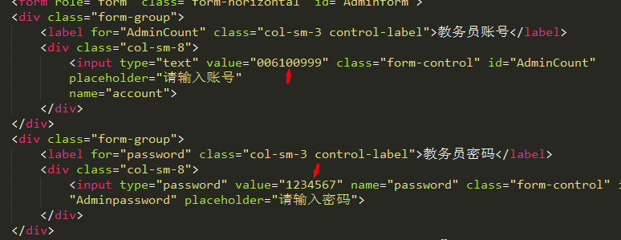
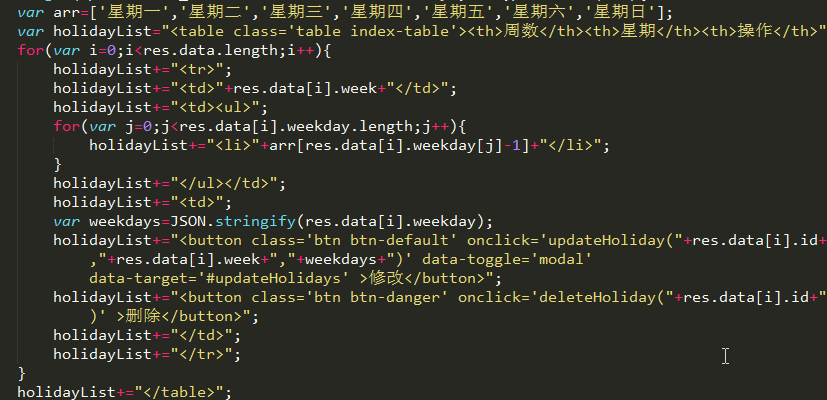

继续教育学院教务管理系统
--------
> 2017-08-08  我的第一个项目，也是一个失败的项目

#### 开始

记得是去年的的10月底，工作室的小伙伴找我合作做项目，那时候迹忆的代码已经提交了，刚好没什么事做，自己虽然和后台合作过了，也做了作品去参加软设，但是还是不够，自己没有写过真正的项目，一开始听后台小伙伴讲大致做什么，以为只是一个简单的管理类小项目，于是欣然答应。

#### 波折

这个项目在一开始看来真的没有什么，就是教师排课，然后学生可以查看自己的课程，但是到后面发现真的是个坑。后面这个系统越扩展越大,后台人员每和客户谈一次就增加一次功能，到后面有学生，管理员，教师，学院教务员四个角色，有各自对应的页面，还有自动排课，排考试，各种文件导出导入等等，项目越来越复杂，而且需求还不断改动，已经远远超出当初谈好的需求，谈好的价钱却没什么变动，价钱也真的很低。在后期写代码时内心也越来越烦，直到后面期末考要复习才停止写项目，过完了寒假又开始了，后台伙伴一直在坚持，我也不好放弃，又花了很多时间去完善修改，到后面又要改，实在是受不了，最后和后台小伙伴放弃了这个项目。因为投入了很多时间，不愿意放弃真的太蠢了，要懂得取舍。

这个项目真的写了很久，前后跨度4个多月，浪费了很多时间，第一个项目就这么结束了，这是一次失败的经历，有点心痛，但是学到了很多，对自己也真的有了能力上的提高，做人要多思考，用户可能连自己想要什么都不清楚，项目需求真的谈好需求再做。后台小伙伴对于这个项目的[感受](http://blog.csdn.net/qq_34881718/article/details/67652954)。

最后一次修改这个项目的时间，定格在这一刻。

#### 收获

后台小伙伴的[收获](http://blog.csdn.net/qq_34881718/article/details/67652954)

我在一开始写代码的时候没有复用的这个概念，只是复制粘贴一时爽，导致需求一改变我就得去改很多地方，当项目特别大时就会乱。

在开发时表单可以一开始就设置默认数据，不用每次都去填写，浪费时间。

应当减少DOM查询，代码增加注释，代码要有缩减，应当使用前端静态模板去渲染，而不是用字符串拼接。看到以前写的代码还是感觉有点糟糕。

......

