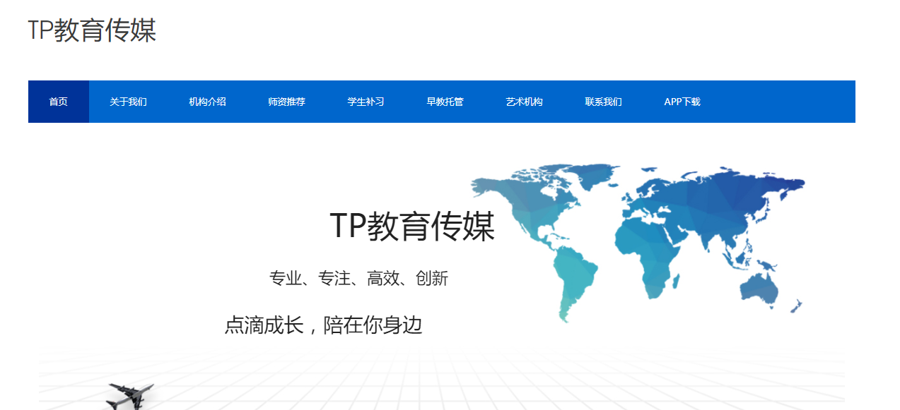
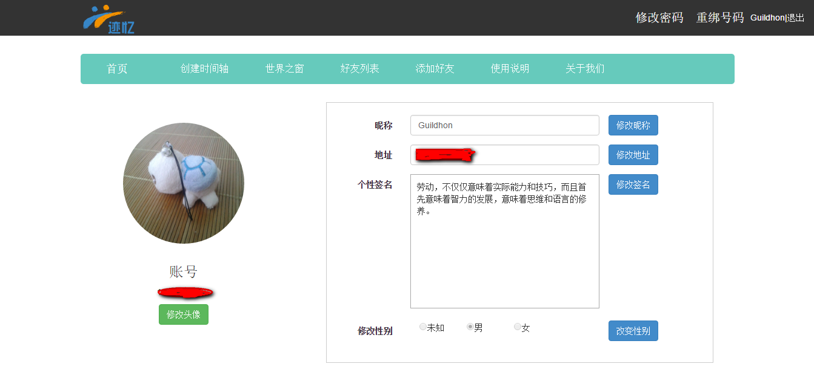

软件设计大赛迹忆作品
--------
> 2017-08-08  我的第一个计算机作品比赛

#### 缘由

在大一的第二学期快结束时，我学习到了许多前端的知识，无论技术还是学习能力上都有了很大的提高，遇到难题，会想办法靠自己解决，跟第一学期相比有了很明显的成长。在学习时看了师兄们写过的项目的代码，轻会议和TP教育项目，轻会议项目前端后端代码混合，使用后端渲染，我只学过前端，导致看得我懵懵懂懂；而TP教育项目，通过调取API实现前后端分离，使用JSON传递数据，整个项目的大致框架容易理清，这个项目让我学到了很多，有很大的收获。

我自己做过的作品只有[邑大书城](https://github.com/Guildhon/bookStore)，非常简单，只有静态界面。而且那时我还没有和后端合作过，学过AJAX，但没怎么用过，想能做一个有前后台交互的网站。正好学校的软件设计大赛要开始报名了，不过自己没有什么好想法，刚好工作室有队伍缺前端，于是组了进去参加比赛。

#### 坎坷

在大一结束的暑假里，由于种种原因，参加队伍的后端和美工人员都联系不上，导致整个队伍完全没有进展，一直到开学。这段时间我去学了一下韩顺平的PHP视频，还有一点TP框架，以及MYSQL的操作。简单了解后台是如何工作的。

#### 赶工

暑假的时候我只写了一点点的代码，开学后就开始赶，开发流程是后台写完MARKDOWM文档，定义好API接口，前端再去调取接口，遇到的第一个问题就是跨域问题，不过还好后台通过CORS解决了。那时申请了腾讯云服务器，使用的是windows server 2012系统，在这之前用过新浪云，不知为何云豆快速消耗完了，就放弃了新浪云。为了能让队员看到效果，于是在云主机上使用WAMP集成环境，将代码放在其www目录下，通过公网IP进行访问。当然搭建WAMP时也踩了不少坑，需要另外安装一些补丁包。不断赶工最后做完了大部分，使用了bootstrap，勉强适应手机端，但是仍然存在很多问题，还是不太满意，但是这个是我第一次完成的有交互效果的作品,还是有点成就感的，[迹忆地址](https://github.com/Guildhon/JIYI)。

#### 止步复赛

在复赛的时候，真的才知道和其它队伍的差距，无论是PPT的演讲，还是项目作品的准备上，真的差太多了，不过还好学到了很多，比如如何在有限的时间内让评委了解整个项目，以及答辩所应该注意到的事项。比赛主要还是比技术，但是其它方面也要注重，虽然止步于此，但是我得到的收获还是蛮大的！

