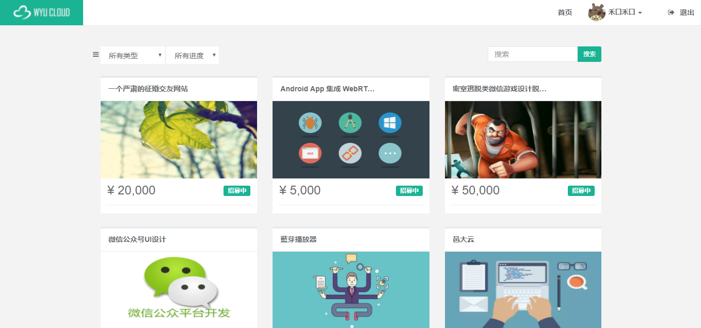
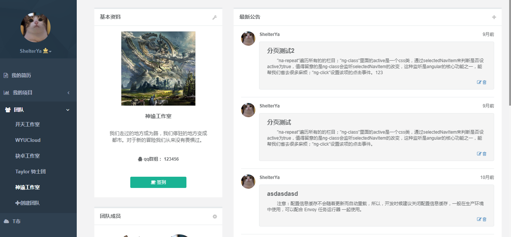
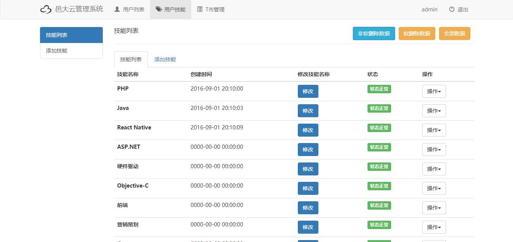

中星杯-邑大云作品
--------
> 2017-08-10  我又写了一个后台管理项目

#### 邑大云的由来

邑大云是工作室的一位师兄开发的，一个为IT学生提供项目实践机会的平台，商家，企业等需求方在邑大云上填写项目需求，发布项目，通过管理员审核后，学生可浏览到。学生可申请，参与到项目招募。项目发布者查看应招的学生简历或团队信息，最后确定招募人选。该项目拿到了学校举办的软件设计大赛三等奖。

#### 我的开发

该项目在参加软设时，没有做后台管理网站，演示时使用的是Postman测试后台添加项目，这是比较遗憾的地方。五月多时有个中星杯比赛，于是我们就接手师兄的项目组队去参加。在从化别墅出游时，队里的小伙伴让我做个后台管理界面，后台接口已经写了一部分，我考虑了很久，确实有个后台管理界面对整个项目的加分还是很大的，让我比较挣扎的是时间问题，那时我有考试需要复习，所以很难抽时间去开发。在这之前我写后台管理界面都是使用jquery，邑大云项目使用的是angular+laravel，后台管理界面也应该要使用angular，我也不想再写一次jquery，虽然那时我已经看完了邑大云的前端代码，大致知道如何用angular去做，但是angualr要是出了bug，调试还是比较麻烦的。考虑到最后我还是决定做吧，不过没做完，大致完成了用户管理，技能管理，T市管理三个地方。沿用的是邑大云的思路去做，以数据为核心，使用ui-router划分路由的单页面应用。

#### 结果

赛场上的队伍几乎都是软件设计大赛的队伍，作品与之前在软设看到的好像没什么区别，上场时我觉得我们队表现非常好，评委也有比较懂技术的。最后我们队伍拿了二等奖，这个结果很服气，因为一等奖的作品确实很厉害。奖金和证书都是比赛完现场发的，效率好高。奖金800块，一部分给工作室经费，一部分换了张新的躺椅，一部分队内平分，真的是很开心，自己的努力做的东西有了回报。

