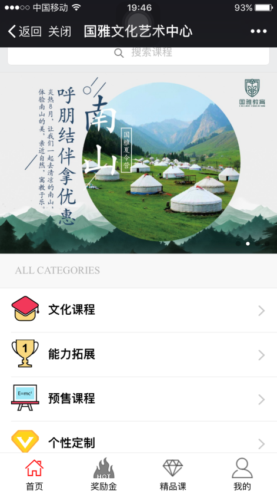
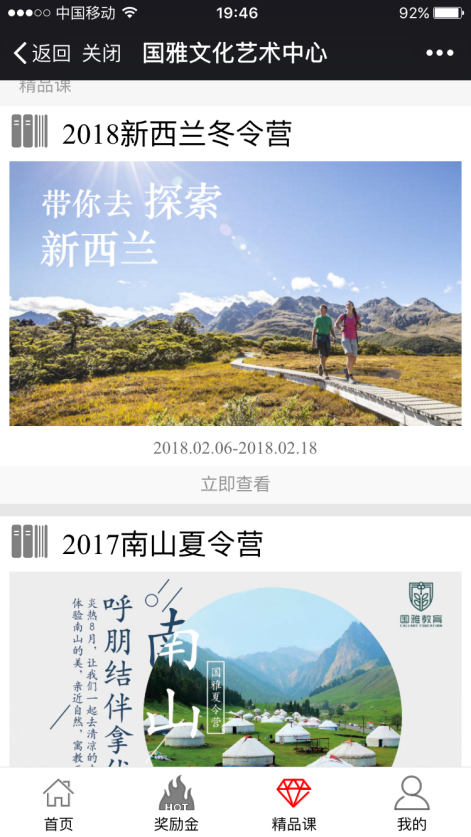
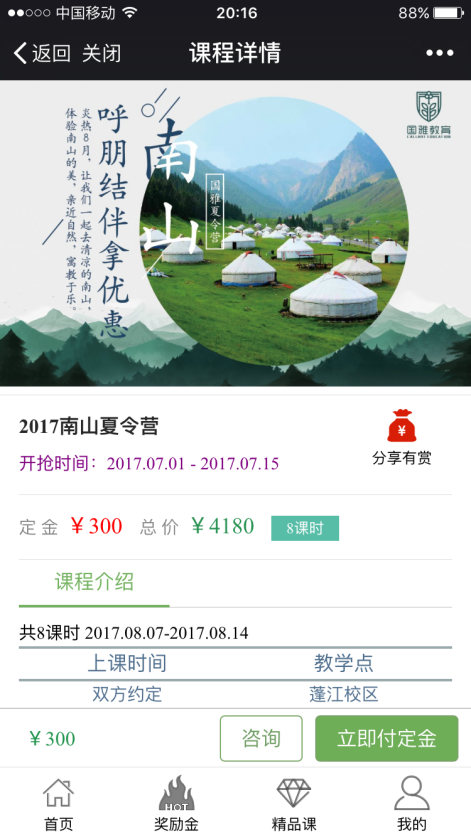
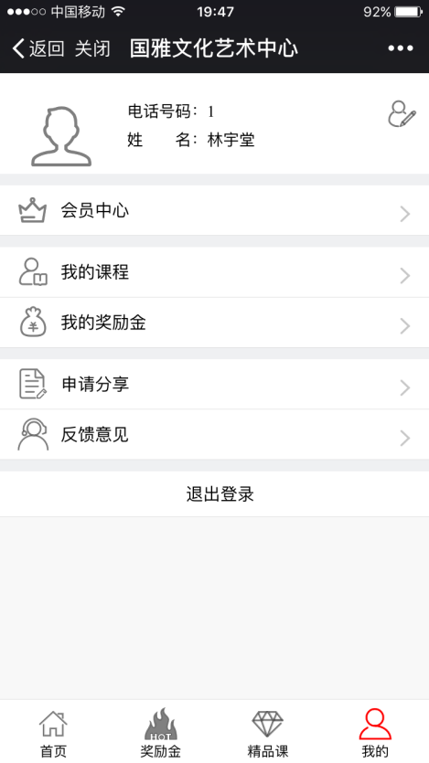
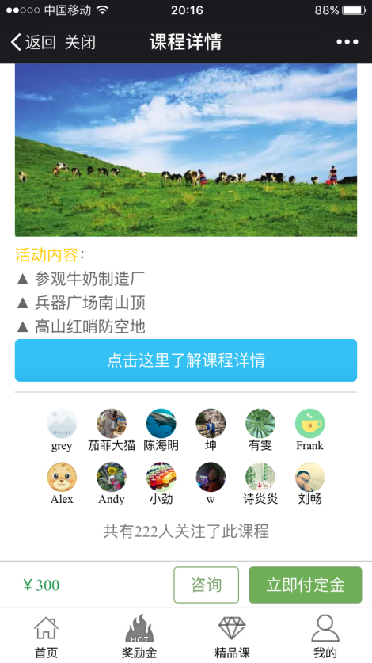

国雅文化艺术中心微商城
--------
> 2017-12-17 终于有设计图让我参考着做了

#### 往日
在以往做项目的时候，都是没有美工给我图的，一般都是参照着后端给的API借口，自己设计界面，这种开发模式是不合理的，会很浪费时间，这次的项目有设计一些图可以让我参考，甚至是照着实现，我的开发时间大大的缩短了。

#### 接下项目
一开始这个项目是不想接下来的，这个项目来的时候已经是6月初的时候了，那时我面临着几门比较难的考试，需要复习，前面已经和Clanner做了两个项目，不缺项目经验了，而且按照国雅那边的要求是要在月底完成，感觉时间有点赶。不过Ivan有点犹豫不决，因为经历过继续教育学院的项目，有些挫败感，可能是想要有一个证明自己的机会，他看上去很想做这个项目的样子。国雅也有派人过来，Ivan叫上我，在工作室讨论，国雅那边态度感觉很好，按Ivan的说法，就是比继续学院项目好很多。后面我忘了是怎么答应下来的，不过我对Ivan提出了一个要求，就是我不写后台管理那部分，我已经写腻了后台管理，那部分安排给了工作室的另一个小伙伴做。

#### 作品部分截图

<h4 style="text-align: center;">项目线上地址</h4>

