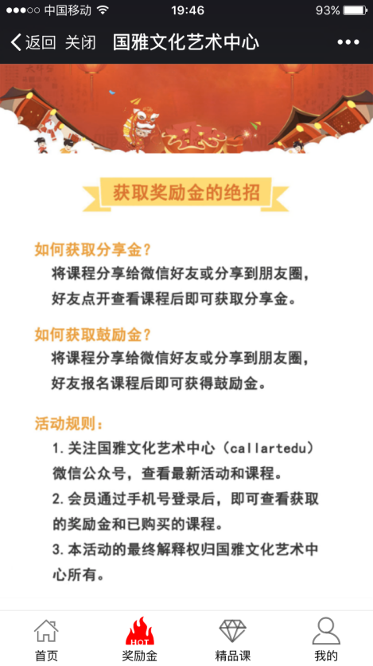

国雅文化艺术中心微商城
--------
> 2017-12-17 终于有设计图让我参考着做了

#### 往日
在以往做项目的时候，都是没有美工给我图的，一般都是参照着后端给的API借口，自己设计界面，这种开发模式是不合理的，会很浪费时间，这次的项目有设计一些图可以让我参考，甚至是照着实现，我的开发时间大大的缩短了。

#### 接下项目
一开始这个项目是不想接下来的，这个项目来的时候已经是6月初的时候了，那时我面临着几门比较难的考试，需要复习，前面已经和Clanner做了两个项目，不缺项目经验了，而且按照国雅那边的要求是要在月底完成，感觉时间有点赶。不过Ivan有点犹豫不决，因为经历过继续教育学院的项目，有些挫败感，可能是想要有一个证明自己的机会，他看上去很想做这个项目的样子。国雅也有派人过来，Ivan叫上我，在工作室讨论，国雅那边态度感觉很好，按Ivan的说法，就是比继续学院项目好很多。后面我忘了是怎么答应下来的，不过我对Ivan提出了一个要求，就是我不写后台管理那部分，当时做了几个后台管理，已经写腻了后台管理，于是那部分工作安排给了工作室的另一个前端小伙伴做。

#### 做的最快的一个项目
国雅那时候的店面在学校的北门，Ivan有常过去跟那边的人讨论谈需求。之前做过继续学院的项目，但是需求不明确，不断改动，最后放弃掉这个项目。国雅的项目做好需求分析，理清思路才开始动工。国雅的要求就是做一个分销系统，一开始计划是很庞大，碍于要求的时间我们只能跟国雅砍需求，保留核心功能。

开发完成的模块有
- 微商城主页
- 奖励金规则界面
- 精品课推荐
- 个人中心

##### 技术难点
凡购买过课程的用户，可点击分享有赏，微信分享此活动页面至朋友圈或微信好友，累积点击浏览次数，累计两人获得一元微信红包返现，最高累计获得量为总金额的4%。累计最高量将停止发放红包。

- 实现微信支付功能
- 公众号发红包
- 分享内容自定义

##### 一点感想

学习到如果是在微信里面，要学会利用微信提供的接口，比如JS-SDK里面的东西。后面有个要求就是点击咨询按钮，显示客服微信二维码，这样用户就可以扫码添加。最后是通过调用微信的图片预览功能实现的。在开发调试的过程中也出现了很多其他问题，解决这些问题真的有能力提高的感觉。这个项目还是学得到挺多东西的。

项目在月底就差不多做完了，比预想的还要快很多，国雅和我们这边都有点震惊。能这么快做好的原因有三部分，能力提高，有项目经验是一部分，需求明确，前端不用浪费时间去设计界面，后端也不用频繁更改表和逻辑是一部分，前端和后端有很好的沟通是一部分。

做完了几个外包，感想真的挺多，虽然做这些项目能拿到钱，但是也耗费了我大量的精力，特别是当做多了以后就会发现都是套路，代码封装得都差不多，很难再有学习上的提升。外包可以适度做锻炼自己，让自己提高自信，但是写久了会被套住，原地踏步。要多去学其他东西，提高自己，生命不息，学习不止。

#### 作品部分截图

<h4 style="text-align: center;">项目线上地址</h4>

