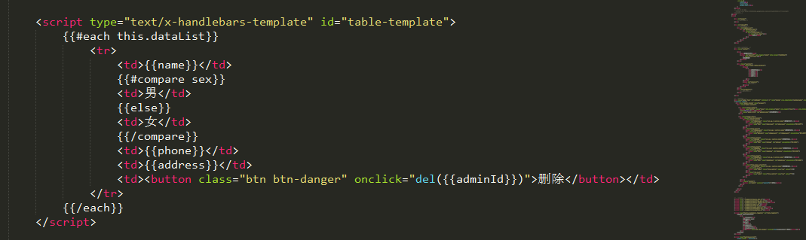
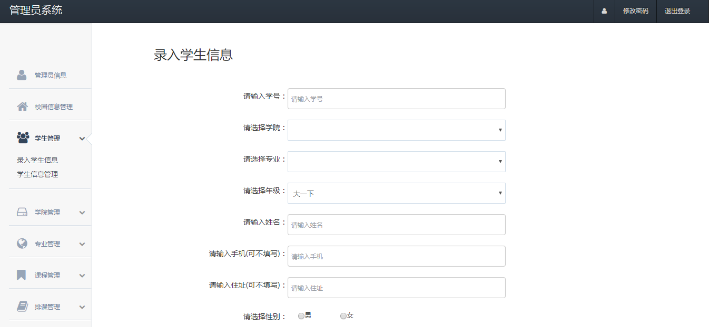

毕业设计-校园信息系统
--------
> 2017-08-09  第一次和Java后台合作 && 第一桶金

#### 缘由

得知这个项目的时候是三月多的时候，这是一个毕业设计，有人找工作室做这个项目，工作室有个小伙伴接了下来，准备用Javaweb写，但是他不会前端，这时我那个继续教育学院的项目已经到了尾声，课也不多，于是就加入进去开始写。没想到不久就拿到了定金300块，第一次靠自己学的东西赚钱，真的是第一桶金，感觉蛮好的，有动力想要快点把它写好。

#### 需求

爬取校园网的数据，展示校内简讯，通知，公告。角色有管理员，超级管理员，学生。超级管理员可对管理员信息进行操作。管理员可对学院信息，课程信息，校园信息，排课信息，专业信息，学生信息进行操作。学生可通过学号和密码查询各个学年的成绩并计算绩点，修改自己的信息，可以选课并查看自己的课表。

#### 开发

后台小伙伴之前是学安卓的，没有踩过跨域这个坑，是第一次和前端合作，所以折腾了一段时间，在服务端配置跨域。我之前有做过继教项目的经验，和这个项目很像，开发起来也快很多，不断改进之前的种种不合理的地方，尽量做到复用代码。写继教项目的时候生成一段HTML是利用字符串拼接的方式，不好看不好改，代码乱，这次项目使用的是handlebars.js，前端静态模板渲染。代码看起来层次合理一些。基本上我负责的前端开发时没遇到什么难题，就算遇到问题也很快就能解决，一路顺畅。

#### 完工

整个项目的开发时间是将近20天，自己都有点不太相信这么快，因为中间工作室还举办了一次女生节，花费不少时间，可能是之前做了项目，自己能力上有了提升。然后就是拿尾款了，除了一点交给工作室，自己拿两百多，这种用自己所学赚点小钱的感觉真的很不错。不过要记住不要做过多外包，做多外包能力不一定会提升，做多了会发现基本上还是套路，应当要多安排一点时间去学习，做外包项目只是来实践所学习到的知识的一种手段。

