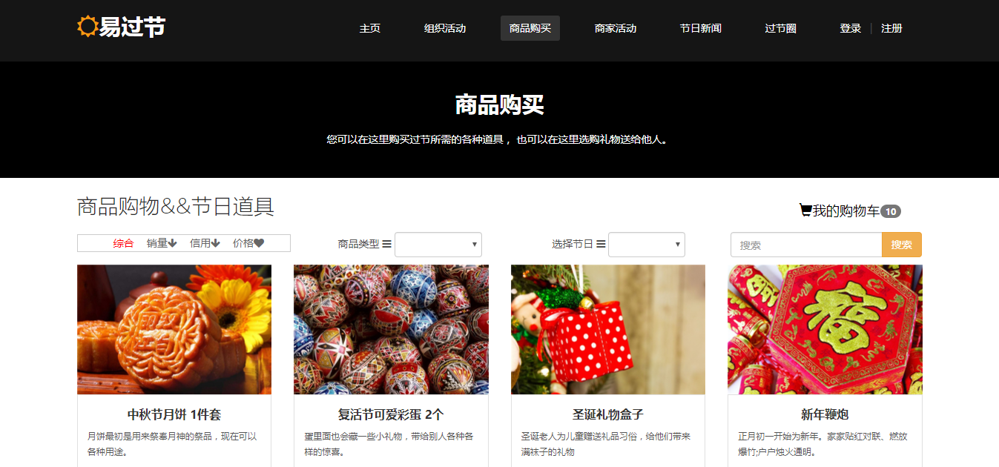

网页设计大赛易过节作品
--------
> 2017-08-09  一个让我有点失望的比赛

#### 初衷

大二的上学期接近尾声的时候，学院要举办第一届网页设计大赛，那时经历了软设的失败，内心还是有点不甘，有点怀疑自己的能力，想要参加一个比赛来证明自己，刚好机会就这么来了。这个网页设计大赛有专业组和业余组，那时一直在想要做什么好，考虑了不少时间，走在路上突然就灵光一闪，好像市面上没有特地为节日开发的应用，像过节组织活动什么的，都没怎么见过，于是去网上搜索查找，写好了项目的需求，组好队直接报名了专业组。报名结果出来后看到报名的队伍，专业组这边没有多少队伍，好像不超过20支，感觉好少，没什么动力。

#### 开发

寒假的时候暂时搁置[继续教育学院教务管理系统](2016/继续教育学院教务管理系统.md)，学习了Angualr和Vue，剩下一些时间去写易过节。但是如果要完成自己预期的功能，时间不够，只能套模板来加快速度，于是通过套模板减少了开发的时间，页面还是采用响应式布局来适配手机端和pc端，一直做到开学时完成度已经很高了。开发时由于有腾讯云服务器，安装了WAMP，配置了webhook，使用coding作为远程仓库，通过git版本控制和上传后，手机可以访问最新页面。偶尔会使用browser-sync，保存代码后实时预览，手机也可以通过电脑作为服务器，局域网访问，而不用每次push上去后再访问，这些都加快了开发的速率。

#### 功能
主页就是来展示主题，用户可以通过主页了解易过节是什么，干什么的。组织活动提供默认模板和自定义模板，可以管理我的活动。商品购买可以展示和购买商品。商家活动用于发布商家的活动，用户可参与。节日新闻，推送过节新闻和视频，查看日历，过节注意事项等。过节圈，用来社交，用户可分享自己的过节感受，管理文章等功能。

#### 比赛准备

准备要给评委现场演示，如果只是IP访问，未免有点难记，而那时我的腾讯云还有一个免费一年域名可以用，于是为这个项目注册了一个域名，yiguojie.cn，服务器当时还跑着其他项目，但是为了能在根路径访问，让后台伙伴写了个php重定向到易过节目录。接着就是写文档了，参照软设比赛的迹忆和趣组队文档写。还有就是PPT的演讲，如何在有限的时间内给评委展示更多内容，如果照着PPT读出来，那样跟复读机没什么区别，所以要PPT与讲的内容有关，但不重复，演讲时要面对评委，不可背对，还有很多要注意的，这些只有参加了比赛才知道。我决定要上去介绍项目，讲PPT，此前没试过，我觉得如果一个人只会埋头去敲代码，那样只会成为一个码农而已，要发展自己的其他方面，挑战自我。大学就是锻炼自己能力的地方，要勇于去表现自己，碌碌无为迟早会后悔。比赛前就是不断练习演讲，和队里的小伙伴讨论，改进的过程。虽然要求里没有要实现数据交互，考虑到评委可能会问有没有，所以队里小伙伴就实现了登录和注册。我以为这个比赛应该偏设计，不会重视有没有后台，所以没有实现其他的数据交互，最后也是由于这个失败的，责任在我。

[易过节项目代码](https://github.com/Guildhon/Festival)

#### 其他队伍

比赛前还有彩排一下，让我们熟悉场地，改掉我们礼仪不到位的地方，以及站位等注意事项。还有讲一次PPT流程，可以看到其他队伍的作品，说实话，真的很失望，有很多队伍他们的作品就像从网上直接扒下来，没怎么改动，场上没有几支我能认同的队伍。对我来说，比赛就是要遇到强队，互相竞争，学习别人的优点，了解自己的不足，用来提高自己的。

#### 比赛

比赛时又学到一招，别人在讲解PPT什么的，排在你之前的都不用管，坐在位置上专心练好自己要讲的，不要去理别人，上台时自信一点，要对自己的作品有信心。对当时评委影响最深的就是问了很多队伍有没有后台。到我们队上场了，当时队里三个人，我负责上台讲PPT，一个负责边演示边介绍PC端，一个给评委演示移动端，最后是答辩，果然评委问到了有没有后台，我们如实回答，其他问题也流畅回答完。之后所有队伍上去讲完就评名次了，我们队伍是二等奖。一等奖在比赛时只讲了PPT，介绍他的作品，主要是把学校的网站爬了，整合到一起，使用到了模拟登录，爬虫等这些，经过继续教育学院那个项目后在我们看来真的没什么，可能评委不了解，觉得很厉害，有后台，但是让我不服的是，我们和评委都没看到他演示自己的作品，甚至连他作品怎么样都不知道，然后我们队就输了。稍微有点失望，如果评委是想看有后台，那就一开始在要求里标注有后台，而不是问我们你们怎么没后台，或者这个比赛应该直接搞建站大赛更正确一点。可能是第一届吧，才会办成这样，结果已经是这样，遗憾是有的，但是只有接受了才能继续前行。

