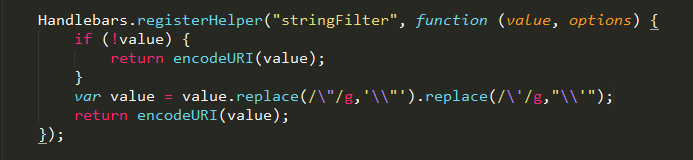
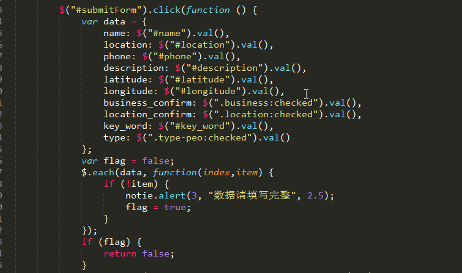

设计联盟后台管理系统
--------
> 2017-08-10  本来以为是一个两三天就搞定的小项目

#### 一个很小的项目

工作室承接了一个项目，做iOS和安卓手机APP，需要一个后台管理的网站，然后工作室小伙伴说功能很简单，我应该两三天就搞定了，于是我答应了下来。然后就是看文档，调接口，又是之前的操作，除了一些接口有Bug，基本上很快就调完了，因为功能简单，所以又犯了老毛病，复制粘贴真的挺爽的，也为后面埋下了坑。

#### 项目预料外的扩大

本来已经完成得差不多了，小伙伴说要增加一些新功能，比如图片上传什么的，于是我又复制(坏习惯)到好几个地方，然后说要增加图片预览，显示图片尺寸大小什么的，整个人有点懵，又要改好几处，于是赶紧把重复代码拎出来复用，重新改了代码。当项目越来越庞大，越来越复杂时才能感到复用的重要性，所以不管项目的大小，首先都要考虑复用。然后就是客户那边提意见，不断修改，功能不断积累，不过几乎都是一个套路，项目最后的功能有：用户信息管理，意见反馈管理，顾问管理，设计管理......都是重复的逻辑，如何把这些逻辑封装起来成了我要解决的问题。开发到后期虽然踩了不少坑，不过还好有开发其他项目时积累的经验，很快发现Bug问题所在。虽然做外包项目对能力是有限的，但是如果没不实战，就不会发现自己考虑的不足之处。

#### 完工

做完这个项目，跨度有两个月，一路修修改改，时间流逝真的好快，和当初预期的有点差别，用的时间有点多。最后还是觉得写得不够好，不过得到很多收获，现在再让自己写一个相似的项目，真的会考虑好多，能做的比当初更完善，这也是一种成长吧。

#### 收获

比较以前写的代码，自从用了Webstorm，代码的缩进得到了控制，现在写的代码比以前那种紧凑好看多了，Webstorm一键格式化真的是太棒了。这次项目还学会处理特殊字符，比如单引号，双引号等的作用，循环判断提交表单是否为空等等技巧，只要是重复数据的就可以用循环......

